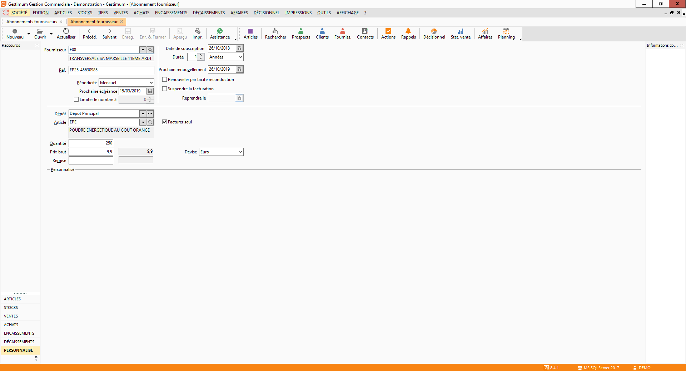

# Abonnement fournisseur

#### Afficher les échéances dans la limite de

Ce nombre de jours permet de limiter les échéances d’abonnements en 
 Facturation des abonnements du menu Achats, à celles arrivant à terme 
 dans les x jours à partir du jour courant.

### Paramétrage de la fiche

Un abonnement est  décrit par :

* Un Fournisseur,
* Un Article,
* Une Devise 
 : la devise de la société est proposée par défaut,
* Une Référence 
 : Information reprise dans la référence du document,
* Facturé 
 seul : cette option vous permet de déterminer si vous souhaitez 
 avoir un article par facture pour ce tiers ou que l’article figurant 
 sur cet abonnement soit regroupé avec d’autres articles issus d’abonnement 
 sur une facture unique pour le même tiers,
* Périodicité 
 : différentes périodicités sont proposées :
* + Journalière
	+ Hebdomadaire
	+ Toutes les 2 semaines
	+ Bimensuelle
	+ Toutes les 4 semaines
	+ Mensuelle, Mensuelle 1er jour, 
	 Mensuelle, dernier jour
	+ Trimestrielle, Trimestrielle 
	 1er jour, Trimestrielle dernier jour
	+ Tous les 4 mois
	+ Semestrielle, Semestrielle 
	 1er jour, Semestrielle dernier jour
	+ Annuelle
* Date 
 de la prochaine échéance,
* Limiter 
 le nombre d’échéances à générer,
* Article 
 : tous les types d’articles sont sélectionnables,
* Quantité,
* Prix
brut : suite à la sélection 
 de l’article, le prix présent sur la fiche article est affiché automatiquement. 
 Si l’article sélectionné est présent sur une fiche promotion ou fait 
 l’objet d’un tarif particulier, c’est le prix de la promotion/tarif 
 et/ou la remise de la promotion/tarif qui seront indiqués. Si vous 
 le souhaitez, vous pouvez saisir un prix différent,
* Remise, une remise particulière à cet abonnement.
* Date 
 de souscription  : il est possible d'indiquer une date 
 de souscription et la durée en nombre de jours, mois, années,
* Prochain 
 renouvellement : il est possible d'indiquer une date de renouvellement 
 et une option de renouvellement par tacite reconduction est également 
 disponibles,
* Echéances 
 d'abonnement : les échéances d’abonnement sont calculées en 
 fonction de la périodicité, de la date de la première échéance et 
 du nombre d’échéances,
* Suspension 
 de l'abonnement : l’abonnement peut être à tout moment suspendu 
 puis réactivé à une date précise,
* Champs 
 personnalisés : les champs utilisateur seront affichés dans 
 la fiche, ils pourront être récupérés directement dans les lignes 
 des factures générées si le champ créé porte le même nom que celui 
 créé dans les lignes de documents.

