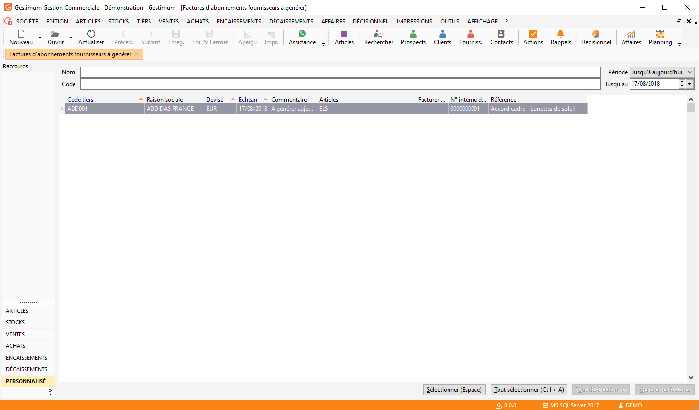
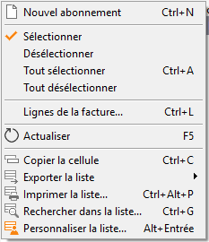
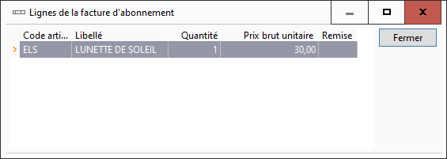

# Echéances d'abonnements fournisseurs
Les factures d’abonnements fournisseurs peuvent être créées, consultées, 
 modifiées, imprimées, puis générées depuis le menu ACHATS 
 | Échéances d'abonnements.

 

 

Le menu contextuel de la liste permet également 
 de sélectionner ou de désélectionner toutes les lignes d’échéances et 
 d’afficher la liste des articles facturés pour une ligne d’échéances.

 

 

L'affichage des lignes de la facture d’abonnement 
 permet de consulter les informations suivantes : 

* Le code article
* Le libellé de l’article
* La quantité facturée de l’article
* Le prix brut de l’article
* La remise affectée à l’article

 

 

Ces informations sont paramétrables à l'aide 
 du menu contextuel. Vous ne pouvez pas modifier directement les articles 
 de cette liste. Pour cela, vous devez obligatoirement changer les données 
 de la fiche abonnement correspondante.

 

Le menu contextuel de cette liste propose 
 les fonctions communes aux autres listes.

