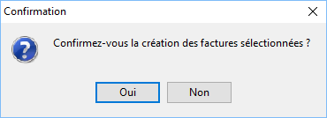
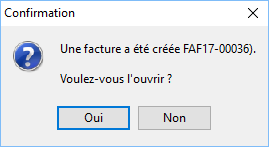

# Génération des factures d’abonnements
Pour générer les factures correspondantes aux fiches d’abonnements, 
 vous devez sélectionner les lignes d’abonnements par la barre d’espace, 
 un Ctrl+Clic, le raccourci clavier Ctrl+A ou par le menu contextuel + 
 Tout sélectionner, il en va de même pour Tout désélectionner.

 

Ensuite, vous devez cliquer sur le bouton "Générer les factures". 
 Un message vous demandera de confirmer la sélection des factures.

 

 

Si pour l’un de vos abonnements, des articles gérant les gammes ou les 
 lots, sont présents, vous avez la possibilité de répartir vos quantités 
 sur différentes gammes ou différents numéros de lot.

 

A la fin du traitement, vous obtiendrez un message d’information de 
 réalisation de la/les facture(s) d’abonnements. Par ce message il vous 
 est possible d’ouvrir la pièce générée.

 

