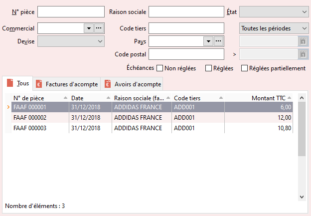

# Liste des documents d'acompte d'achat
La liste des documents d'acompte d'achat est accessible par le menu 
 ACHATS | Documents d'acompte.

 

 

Seuls les documents d'acompte d'achat répondant aux critères 
 définis dans l'entête s’affichent.

 

Les critères sont : 

* N° de pièce
* Commercial
* Devise
* Raison sociale, code, pays ou code postal du tiers
* État
* Période
* Échéances

 

L'onglet "Tous" affiche la totalité des documents 
 d'acompte d'achat. Les autres onglets affichent les documents d'un type 
 en particulier.

 

Les colonnes affichées par défaut sont :

* N° de pièce
* Date
* Raison sociale (facturation)
* Code tiers
* Total TTC

 

Les titres des colonnes contenant un triangle signalent 
 que la liste peut être triée suivant ces critères par simple clic sur 
 le titre.

 

Le pied de la grille affiche le nombre total de documents.

 

Pensez à utiliser le menu contextuel qui propose toutes 
 les fonctions disponibles à partir de la liste et en particulier l’option 
 Personnaliser la liste + Filtres pour générer des listes de documents 
 particulières (par tiers, ...).

