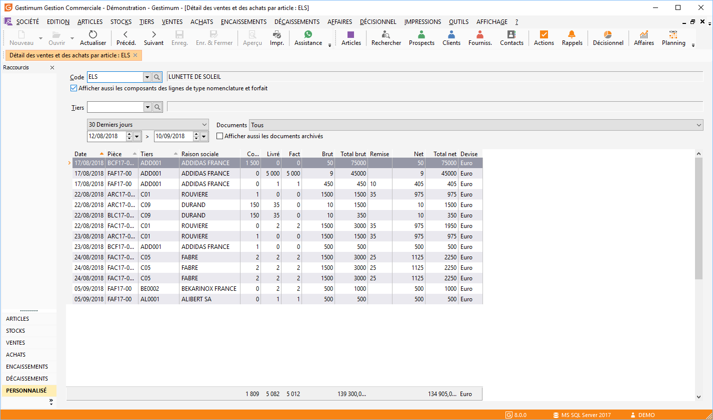

# Détail des ventes et achats par article

Le détail des ventes et des achats par article affiche, pour une période 
 donnée, la liste des pièces à l’attention du fournisseur ou du client 
 avec le total des lignes articles (Quantité commandé, 
 Livré, Facturé, Brut, Net) et avec ou sans les documents archivés 
 .

## Articles

## Tiers

Il est également possible de demander ce détail pour un tiers unique 
 afin de retrouver le numéro de la ou des pièces de vente/d’achat le concernant.

## Menu contextuel

A partir du menu contextuel de cette fenêtre, vous avez la possibilité 
 :

* D’ouvrir la pièce
* D’ouvrir la fiche 
 tiers
* De rafraîchir l’historique
* D’exporter la liste
* D’imprimer l’historique
* D’afficher les 
 totaux de la fenêtre
* De paramétrer la 
 fenêtre grâce aux propriétés

 

L’affichage des totaux concerne la quantité saisie, la quantité commandée, 
 la quantité en reliquat, la quantité livrée, la quantité facturé, le total 
 brut et le total net dans la devise société.

 

Le détail est accessible à partir du menu contextuel :

* De la liste des 
 articles
* De la grille du 
 document

