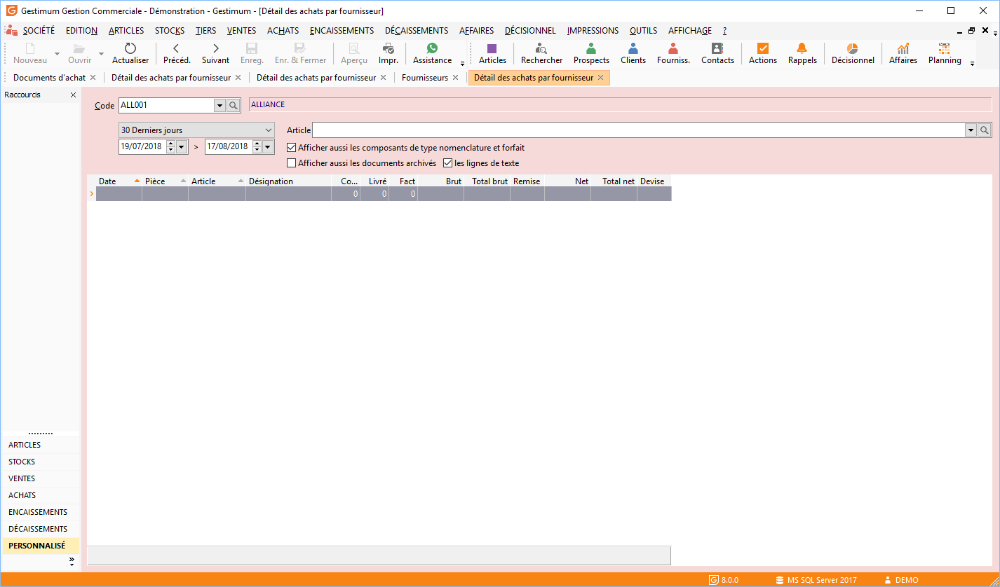
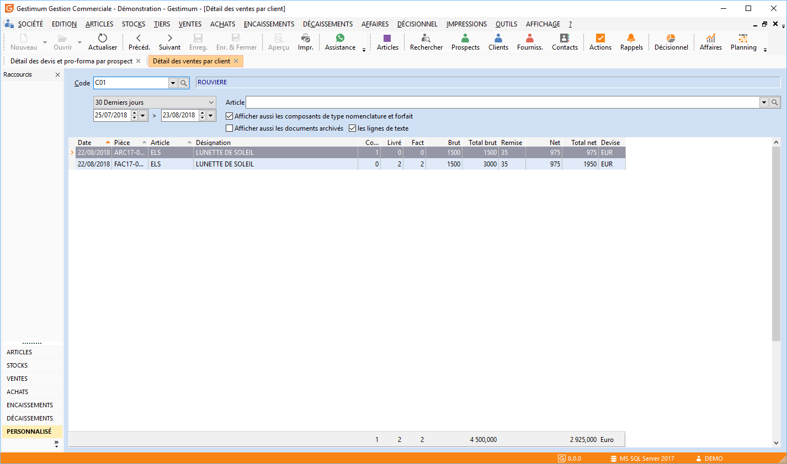
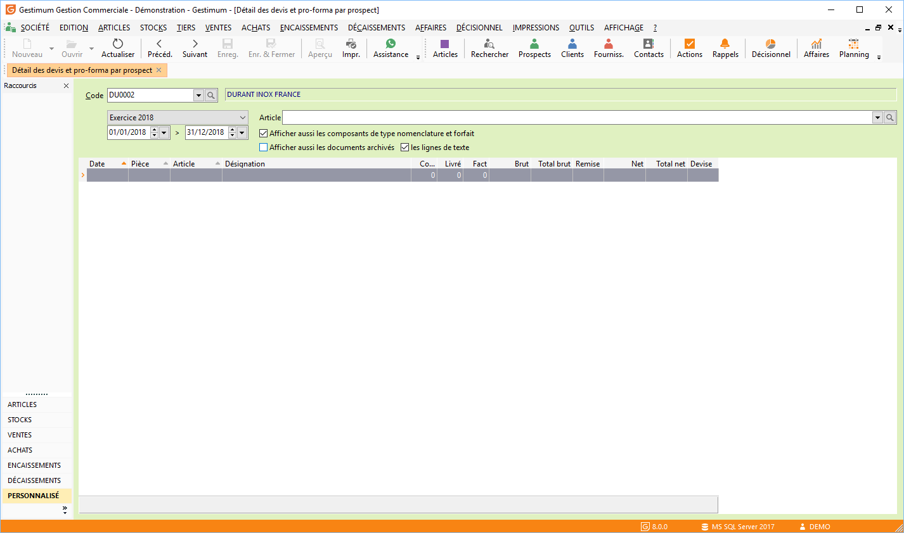
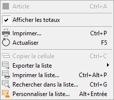

# Détail des ventes et des achats par tiers
Le détail des ventes et achats par tiers affiche, pour une période donnée, 
 la liste des pièces à l’attention d'un fournisseur ou d'un client ou d'un 
 prospect avec le détail des articles (Quantité 
 Commandé, Livré, 
 Facturé, 
 Brut, Net), 
 avec ou sans les documents archivés et les lignes Texte.

## Fournisseurs

## Clients

## Prospects

## Articles

Il est également possible de demander ce détail pour un article unique 
 afin de retrouver le numéro de la ou des pièces d’achat/vente le contenant.

## Menu contextuel

 

A partir du menu contextuel de cette fenêtre, vous avez la possibilité :

* d’ouvrir la fiche article
* d’afficher les totaux de la fenêtre
* d’imprimer le détail
* d'actualiser le détail
* d’exporter la liste
* d'accéder aux fonctions générales d'une grille

 

L’affichage des totaux concerne la quantité saisie, la quantité commandée, 
 la quantité en reliquat, la quantité livrée/réceptionnée, la quantité 
 facturé, le total brut de l’article et le total net de l’article dans 
 la devise société.

 

Le détail est accessible à partir du menu contextuel :

* de la liste des tiers
* de la liste des documents
* de l’entête du document

