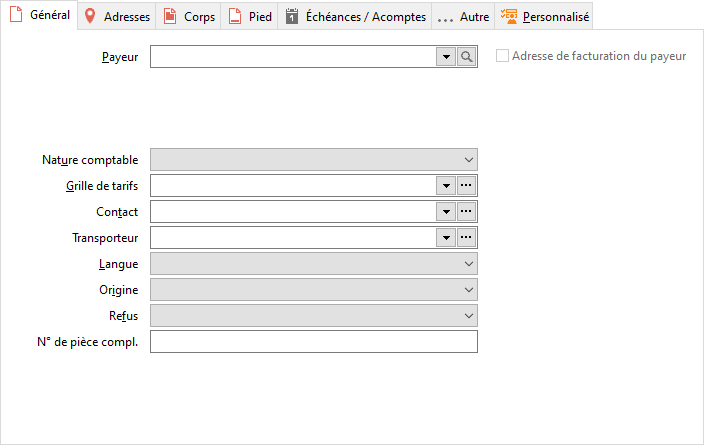

# Général
Vous avez la possibilité de sélectionner les éléments suivant :

* un payeur
* une nature comptable
* une grille de tarifs
* un contact
* un transporteur
* une langue
* une origine
* un refus
* un n° de pièce complémentaire

 

 

Gestimum reprend copie les données de la fiche fournisseur pour :

* Le payeur
* La nature comptable
* La grille de tarifs
* La langue

## Payeur

Si un tiers payeur/ou acheteur (sous-traitance par une société de service, 
 magasin à filiales, …) a été défini dans la fiche du tiers, il est automatiquement 
 repris ici mais reste modifiable.

Le tiers/payeur ne sera plus modifiable si dans l’échéancier du document, 
 il existe au moins :

* Soit une échéance réglée,
* Soit une échéance antérieure au document en cours.

 

Une fois que vous aurez choisi un payeur. La partie facturation au payeur 
 devient également accessible. Par défaut c'est la facturation au payeur 
 qui est cochée.

#### Adresse de facturation au payeur

Un champ booléen « DOC\_FPYEUR » dans la table « DOCUMENTS » pour pouvoir 
 choisir dans un document si l’adresse de facturation est celle du client 
 ou celle du payeur, quand il y en a un.

Ce champ est activé par une case à cocher placée à la droite de la liste 
 déroulante des payeurs. Si le champ payeur n’est pas vide et que la case 
 est cochée, l’adresse de facturation est au nom et à l’adresse du payeur. 
 Sinon elle est au nom et à l’adresse du client.

## Nature comptable

C’est la nature comptable du tiers payeur qui est reprise ici et à défaut 
 la nature comptable du tiers. La nature comptable est obligatoire.

Elle détermine le taux de TVA et les conditions de TPF à appliquer au 
 document.

## Grille de tarifs

La sélection d’une grille de tarif avant de saisir les articles dans 
 l’onglet général, permet qu’elle soit appliquée pour ce document.

 

Cas particulier de changement de 
 grille de tarif :

Lors de la saisie d’un article sans prix de vente dans sa fiche et suite 
 au changement de grille de tarif (grille possédant des remises), la grille 
 de document garde le prix de l’article saisi auparavant et ajoute cette 
 remise.

De même, si on saisi un article qui ne possède pas de prix de vente 
 dans sa fiche et si le tiers possède une grille de tarif avec un prix, 
 lors du changement de la grille de tarif (grille possédant des remises), 
 la grille de document garde le prix de l’article de la 1ere grille de 
 tarif et ajoute la remise de la 2eme grille de tarif.

## Contact

Un contact est une personne dont vous souhaitez conserver des informations 
 administratives et/ou commerciales le concernant. Le contact que vous 
 pouvez affecter au document est obligatoirement lié au tiers pour lequel 
 vous réalisez le document.

Par défaut, aucun contact n’est ramené automatiquement dans le document.

Vous pouvez consulter la liste des contacts, tous tiers confondus, par 
 le menu TIERS/Contacts.

## Transporteur

Il est indépendant du frais de port. Il peut être repris par la suite 
 dans le modèle d'impression.

## Langue

C’est 
 la langue indiquée dans la fiche du tiers (onglet Admin) qui est reprise 
 ici. La langue permet de récupérer, en saisie d’articles 
 et en impression du document le libellé des articles, des frais, des modes 
 de règlements indiqués dans la fenêtre "Traduction de libellés" 
 du menu SOCIETE.

## Origine

Ce champ permet d'indiquer la provenance du document. Il est renseigné 
 automatiquement lors de l'import de document EDI. La liste peut être personnalisée 
 dans les tables de références (menu SOCIETE/Paramétrage).

## Refus

Ce champ permet d'assurer une traçabilité. On peut par exemple déterminer 
 pourquoi une demande de prix n'a pas abouti à une commande. La liste peut 
 être personnalisée dans les tables de références (menu SOCIETE/Paramétrage).

## N° de pièce complémentaire

...

## Abandon des reliquats

...

