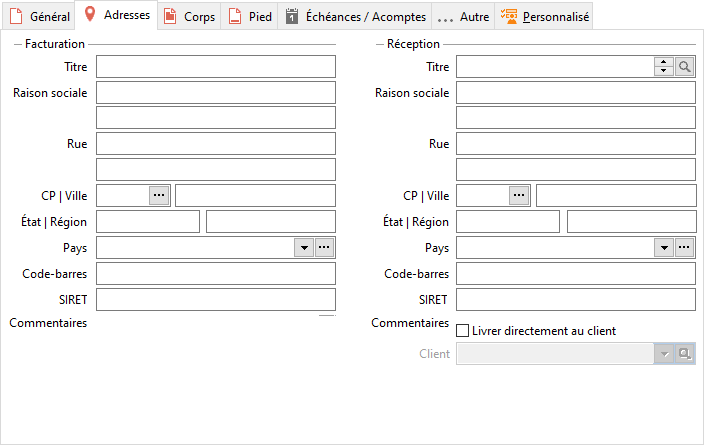
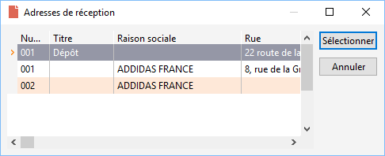
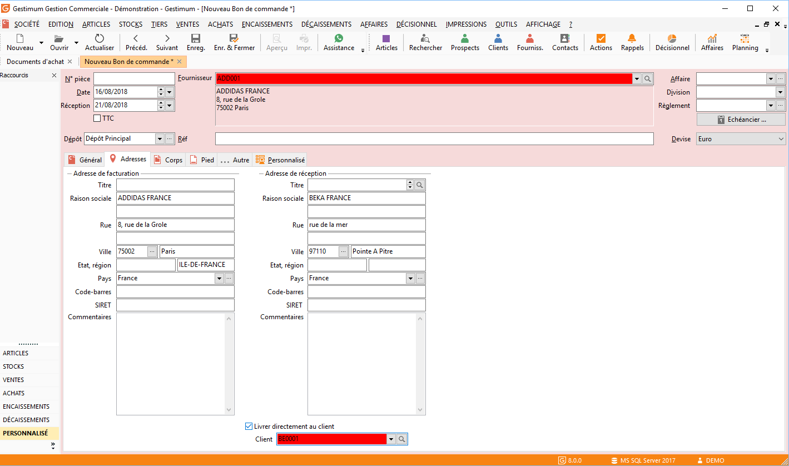

# Adresses

Cet onglet permet de visualiser et de modifier les adresses du document. 
 
  
   
## Adresse de facturation

La partie "Adresse de facturation" reprend toutes les informations 
 stockées de la fiche du fournisseur sélectionné. Vous pouvez cependant 
 les modifiés et elles seront alors spécifiques. 
## Adresse de réception

La partie "Adresse de réception" reprend les infos soit du dépôt 
 principale renseignées dans les préférences de gestion soit du dépôt sélectionné 
 dans la fiche fournisseur. 
  
On a la possibilité de sélectionner une autre adresse 
 qui peut venir d'un autre dépôt, ou d'une autre adresse de la fiche fournisseur. 
 
 

## Livrer directement au client

On peut aussi faire livrer la marchandise directement à un client. 
  
Pour cela, il faut cocher la case "Livrer directement 
 au client" et sélectionner le client qui sera destinataire. 
  

