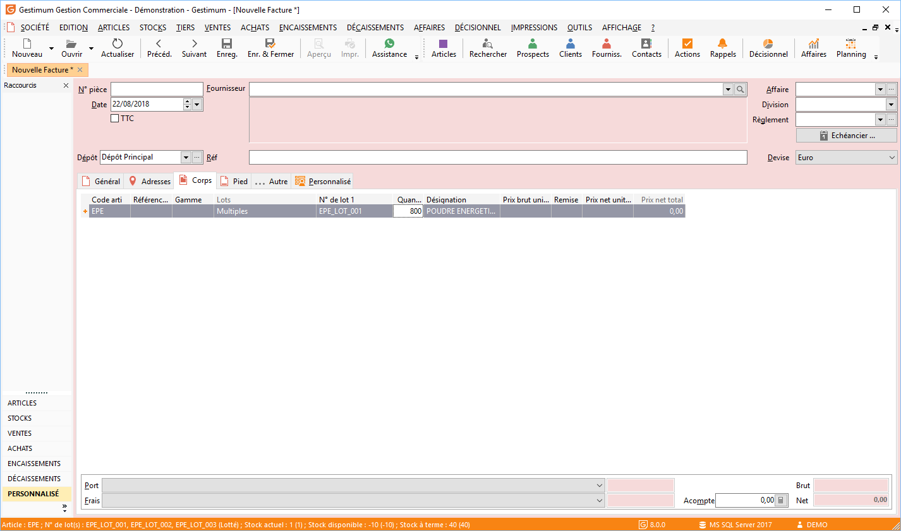

# Lots multiples à la ligne de documents

Depuis la version 4.8, il est possible dans Gestimum ERP d’avoir des numéros de lots multiples à la ligne de document. Vous avez 2 possibilités :

* sélectionner n numéros de lot et avoir une seule ligne pour l'article dans le document,
* sélectionner n numéros de lot et créer une ligne par numéros de lot.

## Paramétrage

Pour activer la sélection multiple de numéro de lot, il faut aller dans l'onglet Stocks des préférences de gestion (menu SOCIETE/Paramétrage) et cocher la case "Saisie de la quantité et sélection multiple possible dans la sélection à partir du stock".

 

La case en dessous permet ensuite de créer autant de ligne de document que de numéros de lot sélectionner.

 

## Utilisation

Dans le document saisissez un article géré par lot.

 

Après avoir saisie la quantité, la fenêtre d’affectation des lots s’ouvre. Il faut alors renseigner la quantité dans "Quantité sélectionnée", ce qui permettra de sélectionner les numéros de lot.

 

   

Après validation des numéros de lot sélectionnés, la colonne «Lots» indique "Aucun", "Un seul" ou "Multiples" et la colonne «N° de lot 1» affiche le premier numéro de lot sélectionné.

