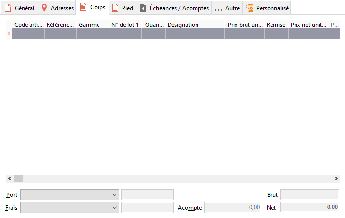

# Corps
La liste des lignes permet d’enregistrer :

 

* des lignes d'articles référencés dans la base article de différents 
 types  : Pièce, Nomenclature, Forfait et de différentes gestions 
 : lot, série, gamme
* des lignes d’articles sans référence
* des lignes d'articles avec une référence non répertoriée
* des lignes de commentaires
* des lignes de sous-totaux
* des lignes de totaux

 

## Description d'une ligne d'article

En réalisation d’un document  d’achat, une ligne d’article est 
 composée des informations de base suivantes :

Référence (code article), Quantité, Conditionnement, 
 Prix et Désignation.

 

D’autres informations peuvent ensuite être introduites : remise, affaire, 
 commercial, TVA, qui dans certains cas sont à paramétrer à partir des 
 propriétés de la grille de saisie.

 

Tous les champs concernant la TVA et TPF sont saisissables en ligne 
 (Taux de la TVA, Nature du type de TVA, Taux de TPF1, Calcul de la TPF1, 
 Taux de TPF2, Calcul de la TPF2, Taux de TVA de la TPF1, Taux de TVA de 
 la TPF2).

### Ligne article : Référence (Code article)

Dans la colonne Article d’une ligne de document, vous pouvez soit :

* Saisir un code article référencé dans la base ou non référencé,
* Lire le code à barre d’un article existant (avec un système de 
 douchette),
* Ouvrir la liste avec la touche F4 ou un double-clic puis sélectionner 
 l’article,
* Laisser la zone vierge pour saisir un article sans le gérer en 
 stock ou introduire un commentaire.

### Ligne article : Numéros de lot

La sélection d’un numéro de lot pour un article dans un document de 
 stock, de ventes ou d’achats s’effectue :

* par un clic dans la colonne lot de la grille de saisie puis ouverture 
 de la liste déroulante. Sur la liste des numéros de lot existant, 
 par la touche F2 ou Inser, vous pouvez ouvrir la liste des numéros 
 de lot,
* par l’ouverture de la fenêtre du stock d'un article qui s’effectue 
 automatiquement si vous avez sélectionner dans le menu contextuel 
 de la grille de saisie l’option "ouverture automatique du stock 
 article pour la sélection du numéro de lot".

 

Si vous êtes configurer pour faire de la [sélection 
 multiple de numéros de lots](Lots/LotsMultiplesLigneDocuments.md), il faudra obligatoirement passé par le 
 2e mode de sélection.

 

Ce principe fonctionne également pour l’article assemblé dans la fiche 
 d'assemblage.

 

Lors d’un transfert, d’une duplication de document, d’une génération 
 d’abonnement ou d’un assemblage pour un article gérant les gammes ou les 
 lots, vous avez la possibilité de répartir vos quantités sur différentes 
 gammes ou différents numéros de lot.

 

La saisie d’un numéro de lot est obligatoire sur les document suivants :

* le bon de livraison/réception,
* le bon de retour,
* la facture,
* l’avoir.

 

Le numéro de lot reste modifiable après validation de la ligne article.

### Ligne article : Quantité

Il est possible de définir une quantité par défaut pour un article donné 
 et une quantité minimale à acheter pour un article et un fournisseur donné 
 dans la fiche de l’article.

Si le stock à terme négatif n’est pas autorisé et que la quantité saisie 
 est supérieure au stock réel de l’article dans le dépôt, un message vous 
 le signale et propose automatiquement la quantité restant en stock.

De la quantité dépend également le prix lorsqu’une grille de tarifs 
 a été définie en fonction d’un seuil.

Vous pouvez saisir une ligne article 
 avec une quantité à zéro. Lors d’un transfert de document, la ligne 
 de l’article sera présente dans le document final avec une quantité à 
 zéro.

L’icône Calculatrice présent dans le champ vous permet d’effectuer des 
 calculs sur les quantités.

### Ligne article : Conditionnement

Dans un document  d’achat, l’unité de conditionnement par défaut 
 est respectivement l’unité de conditionnement  d’achat ou de vente.

### Ligne article : Le colisage

Vous avez également la possibilité de saisir sur chaque ligne (sauf 
 celles de commentaire et de total) la "Quantité d’articles par colis" 
 et le "nombre total de colis pour l’article".

Le nombre de colis est égale à la quantité par colis divisé par les 
 quantités.

La quantité d’articles par colis peut être défini sur la fiche article, 
 onglet Autres.

S’il y a un changement de la quantité, de la quantité par colis ou du 
 nombre de colis alors le nombre de colis et la quantité sont recalculés 
 automatiquement.

### Ligne article : Prix

Dans un document  d’achat, le prix proposé dépend du type de l’article, 
 de la quantité et de la tarification (remise, grille de tarifs, promotion) 
 définie pour le tiers.

 

Le prix s’affiche dans la [devise](PrixDevise.md) indiquée 
 en entête de document.

Le prix est soit HT soit TTC en fonction du choix effectué dans l'entête.

 

Dans un document de stock, une entrée peut ou non être valorisée. Si 
 vous ne valorisez pas l’entrée, le logiciel prendra automatiquement le 
 prix de revient actuel de l’article (ou son prix d’achat) pour valoriser 
 votre stock. Sinon saisissez ici le nouveau prix d’achat pour une unité 
 de conditionnement. Dans un document de stock, une sortie est automatiquement 
 valorisée au prix de revient de l’article lorsqu’aucun prix n’est saisi. 
 Celui-ci dépend des mouvements précédemment enregistrés et du type de 
 stock : PUMP, DPA, PMA,...

#### Visualisation du calcul du tarif de l’article depuis une grille de 
 tarif, promotion ou fiche article

Dans les lignes de document, il est possible d’ajouter la colonne "Grille 
 ou Promotion" (LIG\_GP). Ce champ permet d’afficher sur le document 
 si le tarif de la ligne article provient ou non :

* d’une grille de tarif ("Grille") affectée au tiers/payeur 
 ou au tiers/client (suivant l’option "Grille de tarif du tiers 
 ’ sélectionnée dans les préférences de la gestion),
* d’une promotion ("Promo"),
* de la fiche article (" ").

La colonne "Promotion" (PRM\_CODE) ou "Grille de Tarif" 
 (TAR\_CODE) vous permettent d'identifier exactement le code de la grille 
 ou promotion appliquée sur la ligne.

#### Visualisation et Mise à jour du prix de revient

La mise à jour du prix de revient dans les documents de ventes s’effectue 
 dans les cas suivants:

* changement de code article,
* modification de la Gamme ou du Numéro de lot (uniquement si l’option 
 Sélection du prix de revient de l’onglet stock de la fiche article 
 est "Du stock"),
* à la livraison si l’option "MAJ du prix de revient à la livraison" 
 est sélectionnée.

 

De plus, la modification du prix de revient est possible uniquement 
 si on est dans un document de ventes et si l’option "Prix de revient 
 modifiable" est sélectionnée dans les préférences de la gestion.

#### Prix au débit

Pour un article au débit, le prix est calculé selon différentes formules.

#### Prix au volume

Pour un article au volume, le prix est calculé selon différentes formules.

#### Prix au poids

Pour un article au poids, le prix est calculé selon différentes formules.

## Information lors de la saisie

Lorsque le curseur est positionné sur une ligne de document et si l’article 
 est géré en stock et que l’utilisateur a le droit de consulter les stocks, 
 un certain nombre de renseignements seront affichées dans la barre d’état 
 :

* Le nom de l’article (Article, Gamme, Lot)
* Des informations supplémentaires (Inconnu, Forfait, Nomenclature 
 commerciale ou de fabrication, Gère les gammes et/ou n° de lot et/ou 
 n° de série),
* Le stock actuel ou à terme suivant les préférences. Si la gamme 
 et/ou le n° de Lot ne sont pas renseignés alors vous aurez d’indiqué 
 "Stock à préciser".

Ces informations concernent tous les documents "Achat", "Vente", 
 "Stock" saisissables.

## Acompte

La saisie d’un acompte diminue d’autant le Net à payer du document. 
 Cette zone est commune aux onglets Corps et Pied.

La saisie de l’acompte s’effectue dans l’onglet "Corps" et 
 est automatiquement recopié dans l’onglet "Pied" du document.

Remarque : A la saisie d’un acompte, votre [échéancier](../5EcheancesAcomptes/OngletEcheancesAcomptes.md) 
 est revu avec une ligne d’échéance créée pour que vous puissiez saisir 
 le règlement correspondant à cet acompte.

## Port et Frais

Cette zone est commune aux onglets Corps et Pied. La liste déroulante 
 permet de sélectionner l’un des frais de type Autres frais définis dans 
 "menu SOCIETE/Frais". Le montant est saisissable uniquement 
 lorsque le frais est de type Montant fixe (sans montant). Un frais peut 
 être associé directement dans la fiche du tiers (onglet Commercial), il 
 est alors proposé automatiquement en réalisation du document.

## Menu contextuel

Sur chaque ligne d’article, un menu contextuel donne accès aux opérations 
 suivantes :

* Insérer une ligne,
* Supprimer une ligne,
* Recalculer le tarif de la ligne,
* Recalculer le tarif de toutes les lignes,
* Ajout une ligne de Sous-total,
* Ajout une ligne de Total,
* Sélection multiple,
* Consultation du Stock d'un article et de ses équivalents (stock 
 actuel, stock à terme),
* Sélection à partir du stock article
* Ouverture automatique du stock article pour sélectionner une gamme,
* Ouverture automatique du stock article pour sélectionner un lot,
* Consultation et modification des propriétés de l’article (numéro 
 de série ou contenu du forfait),
* Fiche Article,
* Historique article,
* Effectuer les fonctions générales d'une grille.

 

