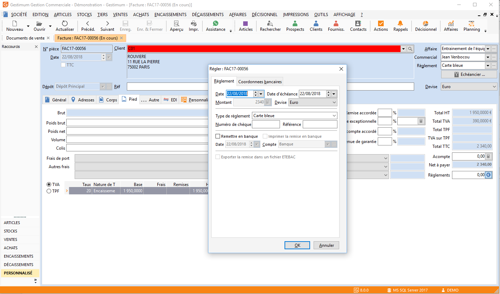

# Règlement depuis le document de vente

Il est possible lors de la saisie d'un document de saisir directement 
 un règlement. Il suffit de cliquer sur l'icône  du champ 
 [Règlements](../5EcheancesAcomptes/OngletEcheancesAcomptes.md) 
 pour vous permettre de saisir et sélectionner les informations nécessaires 
 à la validation du règlement.

