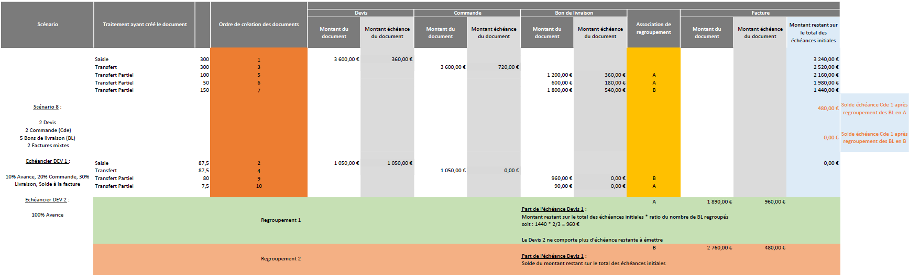

# Echéances et acomptes
A partir de la version 9, le montant des échéances des documents d'achats 
 d’origine ne sont plus transférés partiellement. 

Chaque document est propriétaire de son ou ses échéances. Seule la facture 
 finale portera les échéances des documents qui lui sont rattachés, en 
 plus de ses propres échéances.

 

Pour cela, l’échéancier du document est présenté sous la forme d’un 
 onglet "Échéances / Acomptes" dans le document, qui comporte 
 3 zones distinctes :

• Échéances du document : correspond aux échéances du document en-cours

• Documents d’acompte : factures et avoirs d’acompte rattachés au document

• Échéances antérieures : correspond aux échéances des documents antérieurs

 

Remarque : il n'est pas possible de cumuler 
 l'utilisation du multi-échéances et des documents d'acomptes

 

Les critères de regroupement des échéances sont les suivants : 

+ La date d'échéance
+ Le type d'échéance
+ Le mode de règlement

 

Dans l'échéancier du document, le calcul de la date d'échéance, s'effectue 
 de la manière suivante :

+ Si un mode de règlement est sélectionné : la date se calcule 
 en fonction du paramétrage présent dans le mode de règlement
+ Sinon c'est la date du document qui est reprise par défaut

 

## Regroupement de documents multi-échéances

Il est possible d’effectuer un regroupement de documents portant chacun 
 un paramétrage multi-échéances différent. 

 

Voici un exemple de regroupement ainsi que les différentes explications 
 de calculs effectués lors des différents regroupements et transferts de 
 documents :

 

 

Pour plus de détails, consulter les [Schémas 
 de fonctionnements des échéances et documents d'acompte](../../../../Ventes/Documents/Fiche/5EcheancesAcomptes/SchemaFonctionnementEcheances/SchemaFonctionnementEcheancesAcomptes.md).

