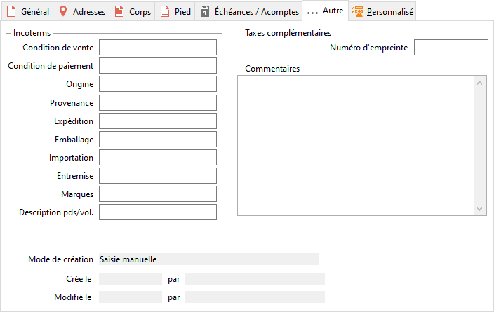

# Autre

Cet onglet permet de gérer les incoterms, un numéro d'empreinte pour les taxes complémentaire et un commentaire général sur le document. On y retrouve également le traitement ayant générer le document.

 

## Incoterms

Les incoterms sont les seuls termes commerciaux internationaux acceptés par les tribunaux en cas de litige pour une évaluation du risque et des coûts afférents au transport de marchandise à l’internationale.

 

|   | Description |
|---|---|
| Condition de vente |   |
| Condition de paiement |   |
| Origine |   |
| Provenance |   |
| Expédition |   |
| Lieu de chargement |   |
| Lieu de déchargement |   |
| Destination |   |
| Marques |   |
| Description pds/vol |   |

## Taxes complémentaires

### N° d'empreinte

Le  correspond au N° de timbre demandé par le service des douanes et qui numérote les documents. Cette donnée est saisissable et modifiable, elle sera transférée lors d’un transfert des documents. Elle n’est pas reprise lors de la duplication d’un document.

### Document administratif pour les douanes

Le champ « Document administratif pour les douanes » est issu de la fiche tiers, ce champ est modifiable directement dans le document.

## Commentaires

La saisie d’un commentaire général sur le document permet d’éditer celui-ci en entête ou pied de page.

## Mode de création

| Traitement | Code |
|---|---|
| Abonnements | ABO |
| Contremarque | CON |
| Duplication | DUP |
| Import | IMP |
| Import EDI EDICOT | EDI |
| Import EDI EDIPHARM ou EDIFACT | EDF |
| Import e-commerce Oxatis | OXT |
| Import EDI Proxiserve | PXS |
| Réapprovisionnement | REA |
| Regroupement manuel | REG |
| Regroupement automatique | RGA |
| Portefeuille de commandes | RLQ |
| Saisie manuelle | SAI |
| Synchronisation PrestaShop | SPS |
| Transfert manuel | TRA |
| Transfert automatique | TFA |

 

