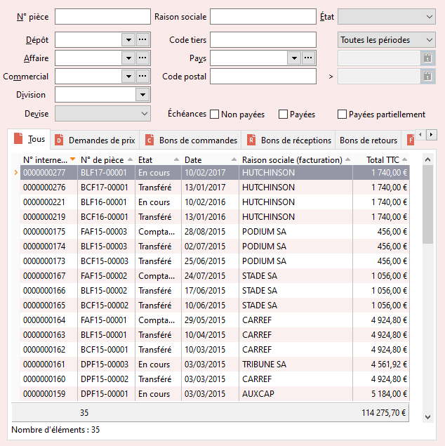

# Liste des documents d'achat
La liste des documents d'achat est accessible par le menu ACHATS 
 | Documents d'achat.

 

 

Seuls les documents d'achat répondant aux critères définis 
 dans l'entête s’affichent.

 

Les critères sont : 

* N° de pièce
* Dépôt
* Affaire
* Commercial
* Division
* Devise
* Raison sociale, code, code pays ou code postal 
 du fournisseur
* Etat
* Période
* Echéances

 

L'onglet "Tous" affiche la totalité des documents 
 d'achat. Les autres onglets affichent les documents d'achat d'un type 
 en particulier.

 

Les colonnes affichées par défaut sont :

* N° de pièce
* Date
* Raison sociale (facturation)
* Total TTC

 

Les titres des colonnes contenant un triangle signalent 
 que la liste peut être triée suivant ces critères par simple clic sur 
 le titre.

 

Le pied de la grille affiche le nombre total de documents, 
 ainsi que le total HT, TTC et la marge.

 

Pour les documents, vous obtenez également la raison sociale 
 du tiers payeur/acheteur, la devise de facturation et le montant facturé 
 dans cette devise.

 

Pensez à utiliser le menu contextuel qui propose toutes 
 les fonctions disponibles à partir de la liste (par exemple le [stock 
 des articles des lignes d'une commande](../../StockArticleLigneCommande/1/StockArticlesLignesCommande.md)) et en particulier l’option 
 Personnaliser la liste + Filtres pour générer des listes de documents 
 particulières (par exemple, les factures et les avoirs,...).

