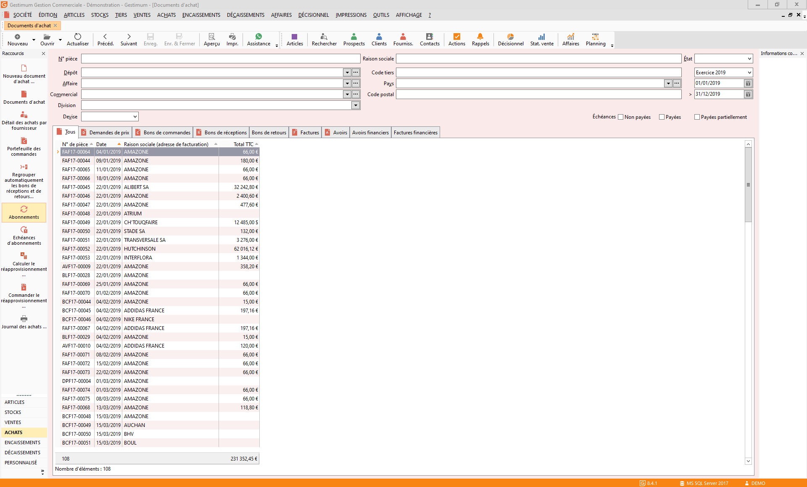

# Liste des documents d'achat - Nouvelle
## Entête

Seuls les documents répondant aux critères définis dans 
 l’entête s’affichent.

 

L’onglet "Tous" affiche la totalité des documents, 
 les autres onglets affichent la liste d’un sous-type particulier de documents.

 

## Critères de recherche

* N° Pièce
* Dépôt
* Affaire
* Division
* Devise
* Tiers Raison sociale / Code tiers / Pays / Code 
 postal
* Critères
* État
* Périodes
* Échéances : non payées, payées partiellement, payées

## Tableau

La liste des documents affiche par défaut, pour chaque 
 document :

* le numéro de la pièce
* la référence de la pièce
* la date de réalisation
* etc

 

Les titres des colonnes contenant un triangle, signale 
 que la liste peut être triée suivant ces critères par simple clic sur 
 le titre.

 

Le pied de la grille affiche le nombre total de document 
 affichés, ainsi que le total HT, TTC et marge des documents.

 

Pour les documents, vous obtenez également la raison sociale 
 du tiers payeur/acheteur, la devise de facturation et le montant facturé 
 dans cette devise.

 

Pensez à utiliser le menu contextuel qui propose toutes 
 les fonctions disponibles à partir de la liste et en particulier l’option 
 Personnaliser la liste + Filtres pour générer des listes de documents 
 particulières (par exemple, les factures et les avoirs,...).

 

