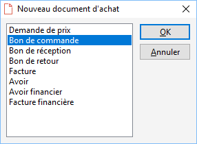

# Nouveau document d'achat
A partir de la liste des documents, plusieurs possibilités sont à votre disposition :

* clic sur l’icône "Nouveau" de la barre d’outils
* raccourci clavier Ctrl + N
* utilisez la touche Inser
* créer à partir du menu contextuel "Nouveau"

 

A l’exception de la touche Inser, toutes ces options sont également disponibles à partir de [l’entête d’un document](../Fiche/0Entete/Entête.md).

 

L'accès à un nouveau document d'achat propose à l'utilisateur de choisir entre différents sous-types de documents :

* [Demande de prix](Types/NouvelleDemandePrix.md)
* [Bon de commande](Types/NouveauBonCommande.md)
* [Bon de réception](Types/NouveauBonReception.md)
* [Bon de retour](Types/NouveauBonRetour.md)
* [Facture](Types/NouvelleFacture.md)
* [Avoir](Types/NouvelAvoir.md)
* [Avoir financier](Types/NouvelAvoirFinancier.md)
* [Facture financière](Types/NouvelleFactureFinanciere.md)

 

 

Le sous-type de document sélectionné par défaut est paramétrable dans les préférences de gestion.

 

Une fois le choix confirmé, vous accédez automatiquement à [l'onglet "Corps"](../Fiche/3Corps/OngletCorps.md) du document choisi.

