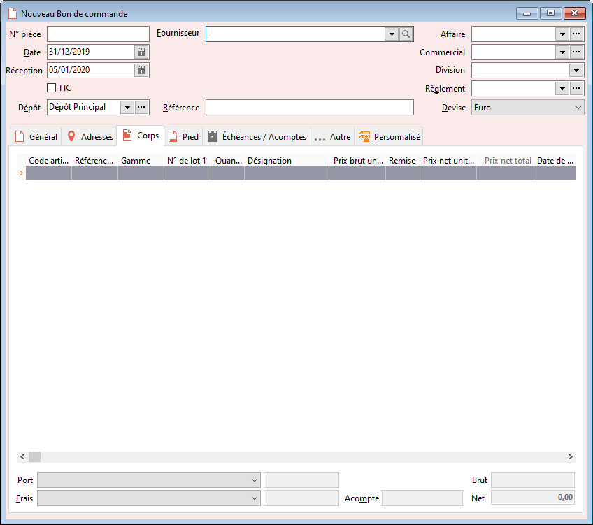

# Nouveau Bon de commande

La réalisation d’une commande fournisseur peut être manuelle ou automatique 
 en passant par les outils de réapprovisionnement.

 

En réalisation de document, la date prévue de réception est calculée 
 à partir du délai de réception général (voir les préférences de la gestion). 
 Vous pouvez également définir un délai de réception particulier pour un 
 article et un fournisseur donné (voir fiche Article + onglet Fournisseur 
 "Délai de réapprovisionnement"), dans ce cas le logiciel recalcule 
 automatiquement la date prévue de réception en prenant en compte le délai 
 le plus grand.

 

Dans le corps d’une commande, vous pouvez introduire la référence de 
 l’article chez le fournisseur ou la paramétrer directement dans la fiche 
 article (onglet Fournisseur).

 

L’encours maximum de la commande prend en compte le solde du "Commandé" 
 présent sur la fiche tiers (onglet Compta).

 

Ce document peut être transféré en bon de réception et facture.

 

Le bon de commande met à jour le stock théorique « à terme » 
 et le stock des commandes fournisseurs.

 

