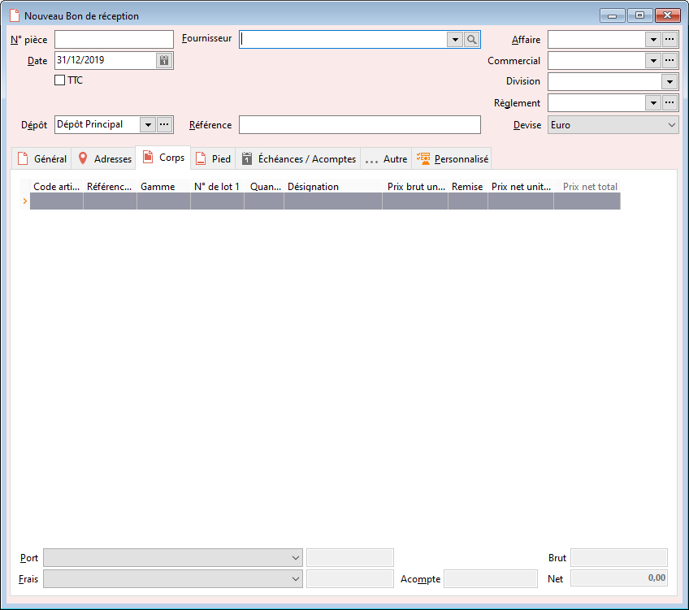

# Nouveau Bon de réception

Le bon de réception peut être réalisé manuellement, à partir d’un transfert 
 de devis ou d’accusé de réception ou encore par l’affectation des commandes.

 

Le bon de réception enregistre la réception, partielle ou totale, d’articles 
 à un fournisseur.

 

Ce document peut être transféré en facture.

 

Le bon de réception met à jour le Stock actuel.

 

