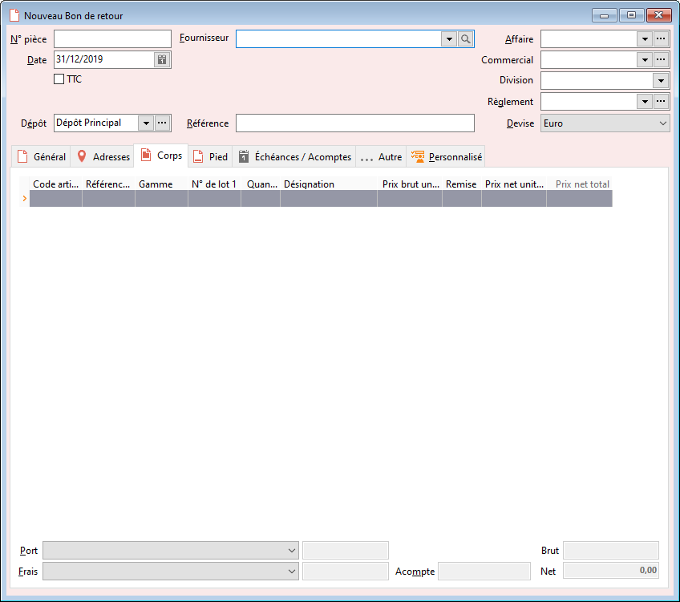

# Nouveau Bon de retour

Le bon de retour peut être réalisé manuellement, ou au travers de la 
 duplication d'un autre sous-type document.

 

Le bon de retour enregistre la reprise d’articles déjà réceptionnés 
 / livrés.

 

Le bon de retour fournisseur met à jour le stock Actuel.

 

Le prix introduit lors de la reprise d’un article a pour effet de modifier 
 le PMP de l’article.

 

