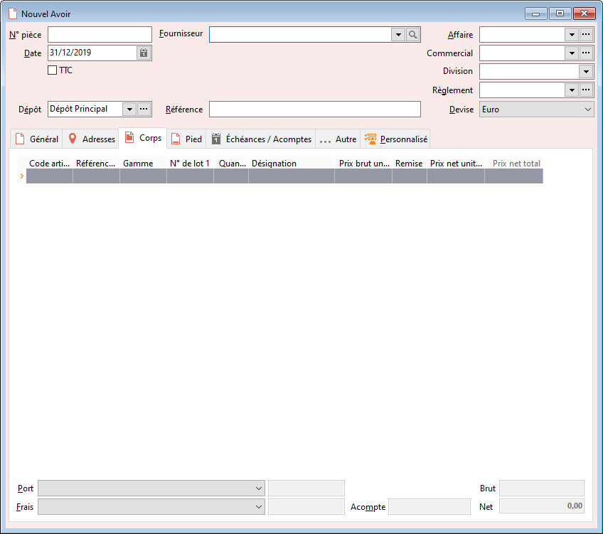

# Nouvel Avoir

L'avoir peut être réalisée manuellement, via transfert depuis une facture, 
 ou au travers d'un regroupement de bons de retour.

 

L'avoir comptabilise les articles effectivement retournés à un fournisseur.

 

Les quantités en sorties sont mises à jour et l'avoir est comptabilisé.

 

L'avoir fournisseur met à jour le stock Actuel.

 

