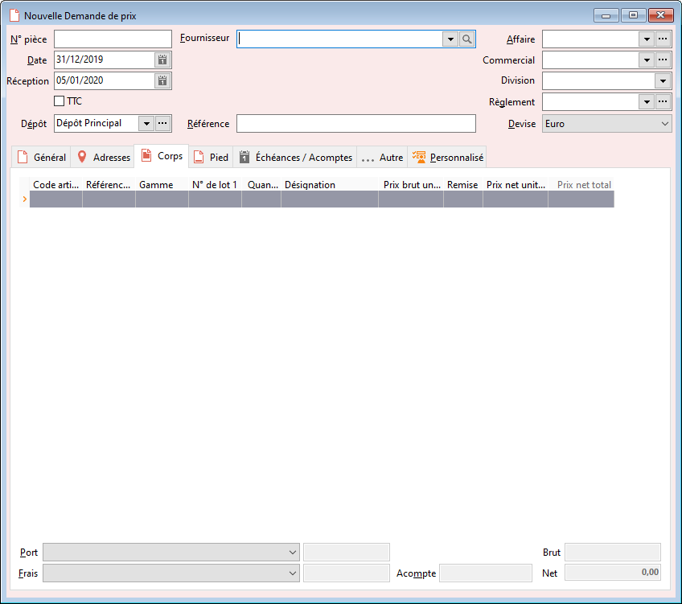

# Nouvelle Demande de prix

Une demande de prix est utilisée dans le cas où vous envisager d'effectuer 
 l'achat de certains articles, et que vous souhaitez que votre fournisseurs 
 vous transmettre une offre tarifaire.

 

Ce document peut être transféré en bon de commande, bon de réception 
 et facture.

 

Aucune action n’est effectuée sur le stock.

 

