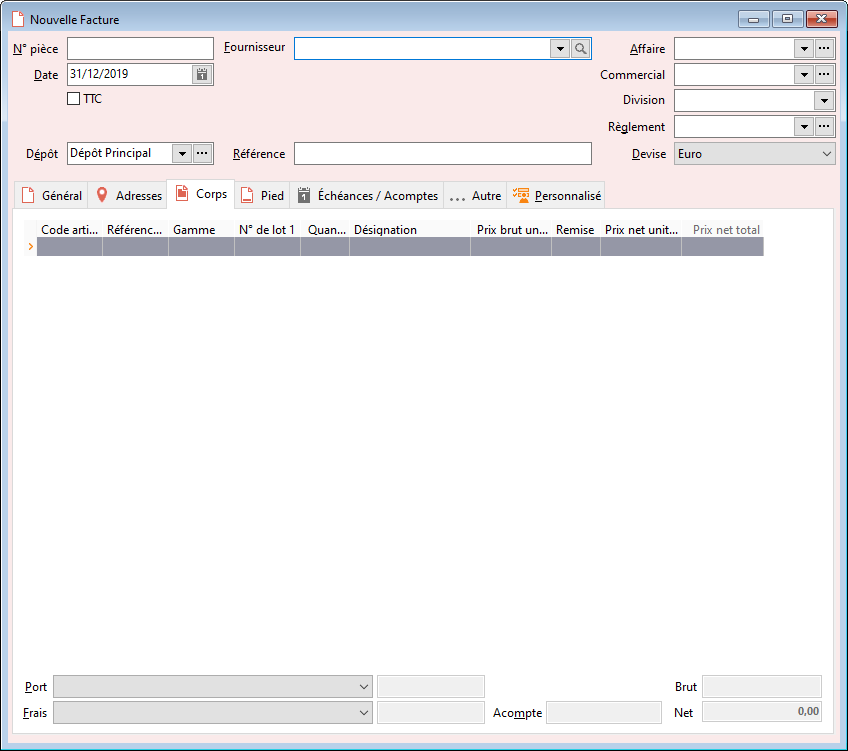

# Nouvelle Facture

La facture peut être réalisée manuellement, ou au travers d'un regroupement 
 de bons de réception.

 

La facture comptabilise les articles effectivement achetés à un fournisseur.

 

Les quantités en entrée sont mises à jour et l'achat est comptabilisé.

 

La facture fournisseur met à jour le stock Actuel.

 

