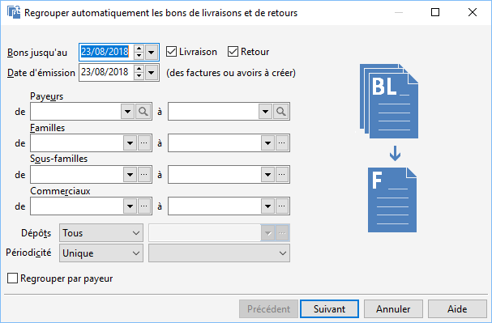
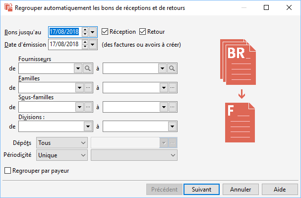
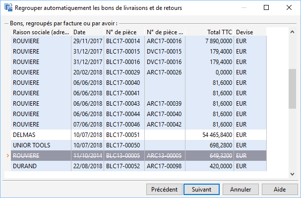
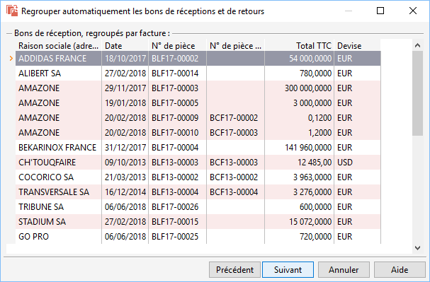
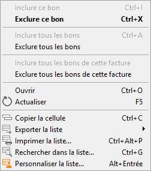
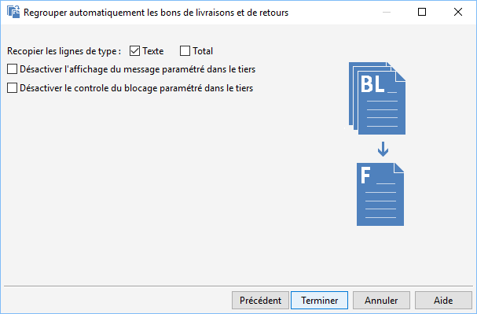
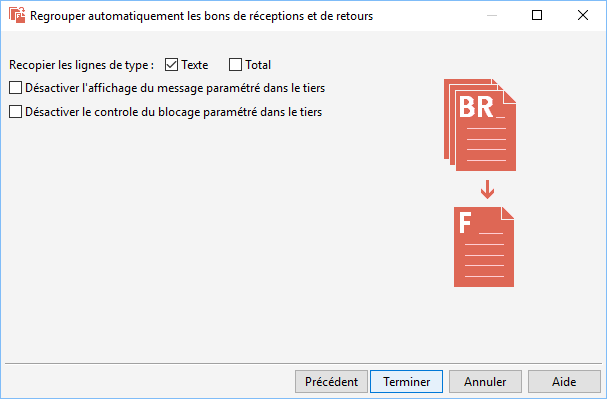
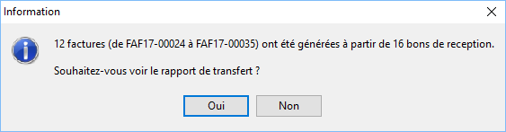
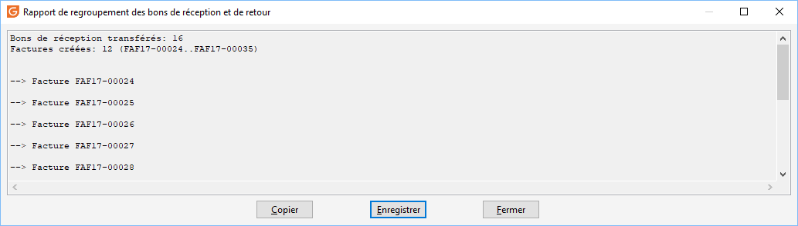

# Regroupement en masse des livraisons clients et réceptions fournisseurs

Le regroupement des bons de livraison/bons de réception/bons de retour 
 permet de générer une facture/un avoir pour un ensemble de bons de livraison/bons 
 de réception/bons de retour.

 

Le regroupement des bons peut être demandé pour un fournisseur, tous 
 les fournisseurs ou les fournisseurs appartenant à la même périodicité 
 de regroupement.

 

Le choix des bons à regrouper dépend du type de regroupement indiqué 
 dans la fiche du tiers. Vous pouvez en effet demander dans la fiche de 
 chaque tiers (onglet Compta) la génération d’une facture unique :

* pour la totalité des bons du tiers (Tous)
* pour chaque bon (un seul)
* pour tous les bons d’une même commande 
 (dans le cas de livraisons/réception partielles)
* pour tous les bons réalisés sur la même décade 
 (période de 10 jours : "du 1 au 10" ou "du 11 
 au 20" ou "du 21 à la fin du mois")
* pour tous les bons de même mois

## Critères de recherche

 

Par défaut la présélection des bons s’effectue suivant la date système. 
 Tous les bons "En cours" saisis avant la date saisie dans la 
 zone "Bons jusqu’au" seront pris en compte.

 

Vous avez la possibilité de prendre :

* Tous les bons
* Uniquement les bons de réception
* Uniquement les bons de retour

 

La date d’émission des factures/avoirs à générer est par défaut la date 
 système, il vous est possible de modifier cette date.

 

Par défaut, le regroupement s’effectue sur les bons de la totalité 
 des clients/fournisseurs appartenant à la même périodicité, mais vous 
 pouvez préciser le regroupement :

* des bons pour un fournisseur ou une fourchette de tiers
* des bons pour une famille ou une fourchette de familles
* des bons pour une sous-famille ou une fourchette de sous-familles
* des bons pour un représentant ou une fourchette de représentants 
 (commerciaux)

 

De même, il est possible d’effectuer l’opération sur un, tous ou un 
 ensemble de dépôts.

### Fournisseur unique

Pour un fournisseur unique, saisissez le code du fournisseur ou recherchez 
 le dans la liste. Le premier bouton vous permet de sélectionner le tiers 
 dans la liste déroulante, le deuxième ouvre la fenêtre de recherche des 
 tiers.

### Périodicité de regroupement

Les périodicités sont à créer dans les tables de référence (menu SOCIETE/Paramétrage).

Vous avez le choix entre toutes les périodicités, aucune périodicité 
 (sans) ou une périodicité précise 
 (unique).

Le regroupement s’appliquera à tous les fournisseurs ayant cette/ces 
 périodicités indiquées dans leur fiche (onglet Compta).

## Sélection des bons

 

Tous les bons réalisés avant la date de référence pour la sélection 
 des fournisseurs s’affichent ici.

 

Vous visualiserez les regroupements des factures avec les couleurs de 
 lignes paires/impaires paramétrables dans l'onglet général des préférences 
 de la société. Une couleur représente une pièce. Il vous est possible 
 d’inclure ou d’exclure tous les bons d’une facture (menu contextuel + 
 Tout inclure Facture ou Tout exclure Facture).

 

 

Vous avez plusieurs choix pour exclure certains bons du regroupement :

* double-cliquez simplement sur le bon,
* appuyez sur la Barre Espace,
* ouvrez le menu contextuel puis Exclure,
* par le raccourci clavier CTRL+E.

 

Le bon est alors barré dans la liste.

 

De plus, le menu contextuel vous permet d’ouvrir le document, d’Inclure, 
 de Tout inclure et de Tout exclure les documents de la liste. Des raccourcis 
 clavier sont également affecté à ces fonctions.

 

Le menu contextuel vous permet d'accéder aux fonctions générales d'une 
 grille.

 

Par ce menu + Personnaliser la liste, vous pouvez paramétrer la fenêtre 
 de la liste des bons à facture. Vous pourrez voir ainsi par exemple :

* le nom du tiers,
* la date de réalisation du bon,
* le numéro de pièce du bon,
* le montant TTC,
* la devise de réalisation du bon,
* le numéro de la pièce d’origine (pièce précédent le Bon),
* le type de regroupement,
* la période prise en compte pour le regroupement par décade,
* la période prise en compte pour le regroupement par mois.

## Options supplémentaires

 

Cet onglet vous permet de paramétrer les lignes des documents à regrouper 
 et de lancer le traitement de regroupement des bons.

### Recopie des lignes

Dans les factures émises, vous avez le choix de reprendre ou non les 
 lignes de texte et les lignes de totalisation (Sous-total et Total) présentes 
 sur les bons.

### Traitement

Lorsque vous cliquez sur le bouton Terminer, le logiciel génère les 
 factures en fonction du type de regroupement propre à chaque tiers.

Lorsque l’un de vos bons fait référence à un numéro de lot ou de série, 
 une fenêtre est ouverte afin que vous puissiez saisir ce numéro.

 

A la fin du traitement, vous avez la possibilité de visualiser et d’enregistrer 
 un rapport de traitement.

 

 

 

Le corps de la facture générée est composé d’une ligne de commentaire 
 reprenant la référence saisie en entête du bon, précédée éventuellement 
 du numéro du bon (option de transfert à cocher dans les préférences de 
 la gestion) et des lignes d’articles du bon.

 

Tous les bons transférés en facture passent en état "Transféré". 
 Ils restent donc consultables à partir de la liste des documents du menu 
 "Achats" si vous demandez l'état Transféré.

