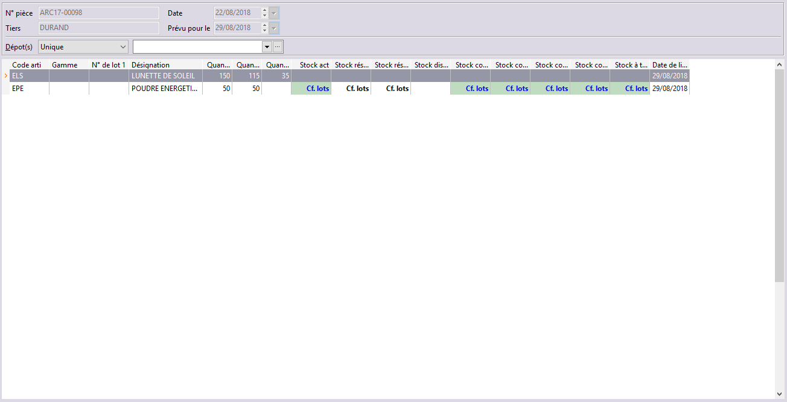

# Stock des articles des lignes d'une commande

La consultation du stock d’une commande est accessible à partir de la 
 liste des documents de vente grâce au menu contextuel + Stock des articles 
 des lignes.

 

La consultation de la commande reprend automatiquement en entête les 
 renseignements de la pièce (numéro, tiers, date, prévue le), le dépôt 
 sélectionné sur la pièce (Unique+Nom 
 du dépôt) et affiche les articles commandés.

 

Pour chaque article, vous obtenez le code, la désignation, la quantité 
 commandée, restant à livrer (reliquat), déjà livrée, la date de livraison, 
 gamme, numéro de lot.

 

Vous visualisez également des informations (stock actuel, stock en commandes 
 fournisseurs, stock en commandes clients total, stock en commandes clients 
 (articles), stock en commandes clients (composants) et stock à terme qui 
 apparaissent en vert car elles n’ont pas de rapport avec la pièce d’origine. 
 Ces informations sont calculées pour le ou les dépôts sélectionné(s) 
 en entête.

 

Pour un article nomenclaturé ou forfait, visualisez au fur et à mesure 
 de vos commandes clients l’état du stock réel, à terme et des commandes 
 clients (articles, composants) et fournisseurs passés sur votre article, 
 ainsi que tous les niveaux de la composition.

 

Le menu contextuel de cette fenêtre vous permet d’avoir le [détail du stock de l'article](../../../../Stocks/Stock/1-1/Stock.md) 
 de la ligne sélectionnée et vous donne accès aux propriétés de la liste

 

