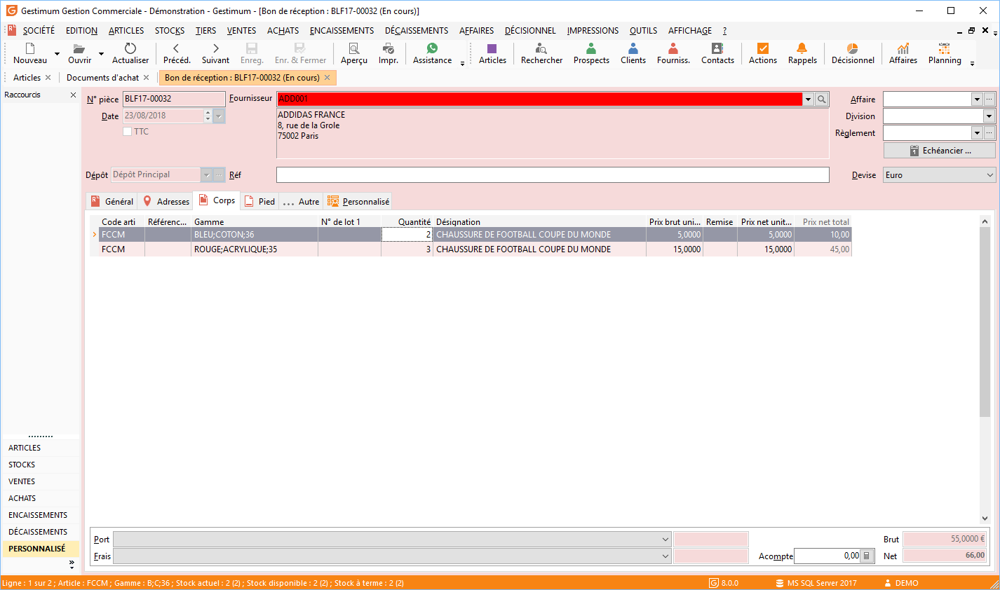

# Exemple d'affectation de gamme ou de numéro de lot

Lors d’un transfert, d’une duplication de document, d’une génération 
 d’abonnement ou d’un assemblage pour un article gérant [les 
 gammes](../../../../Articles/Gammes/1/Introduction.md) ou [les 
 lots](../../../../Articles/1/Article/OngletStock/GestionNumerosLots.md), vous avez la possibilité de répartir vos quantités sur différentes 
 gammes ou différents numéros de lot.

 

Cette répartition est possible à partir du moment ou vous avez sélectionner 
 l’option Sélection explicite des quantités dans le menu contextuel de 
 la [grille 
 de sélection](../../../../Ventes/Documents/TransfertDuplicationDocument/4/AffectationGammeLot.md).

 

L’exemple consiste à affecter les gammes pour l’article "Chaussure 
 de football Coupe du monde".

Lors de la réception, nous lui livrons 5 articles mais dans 2 gammes 
 différentes :

* 2 Pour la gamme Medium;Bleu;Sport
* 3 Pour la gamme extra large;Beige;Classique

  

