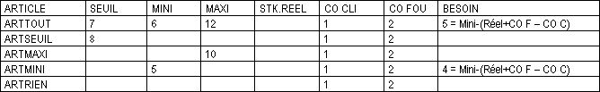
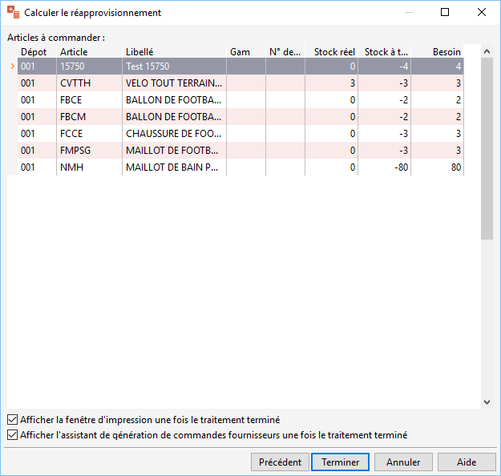

# Calculer le réapprovisionnement

Avant de lancer l’opération de réapprovisionnement, un paramétrage précis 
 doit être effectuée.

 

## CONSULTATION DES ARTICLES À RÉAPPROVISIONNER

La recherche des articles à réapprovisionner s’effectue dans un dépôt 
 précis, dans plusieurs dépôts, en global, pour une fourchette d’articles 
 donnée.

 

* Lorsqu’un même article est en rupture dans plusieurs dépôts, il 
 vous est possible de regrouper ces quantités sur le dépôt principal.
* La définition de la fourchette d’articles prend en compte les critères 
 suivants : code article, famille, sous-famille, type de l’article 
 ou catégorie de l’article.
* Sélection SQL : Permet de définir une requête précise pour définir 
 une sélection d’articles particulière.

## ARTICLES À COMMANDER

### Particularités sur les articles gérant les gammes et les lots

Pour un article gérant les gammes et les numéros de lot, plusieurs lignes 
 de réapprovisionnement peuvent être générées. En effet, vous aurez plusieurs 
 lignes avec des gammes et/ou des numéros de lot différents pour un article 
 à réapprovisionner.

Si vous avez saisi un numéro de lot ou une gamme sur votre/vos accusé 
 réception, le réapprovisionnement affichera ces numéros/gamme. Sinon, 
 il ne vous demandera pas de numéro de lot, ni de gamme, les colonnes resterons 
 vides.

 

Pour la gestion des articles lot, lorsque vos commandes ne comportent 
 pas de lots précis, vous avez 2 possibilités :

* La demande de réapprovisionnement classique : Le besoin tiendra 
 compte du stock réel de chaque n° de lot saisi ou non dans les commandes.
* La demande de réapprovisionnement regroupée : Le besoin tiendra 
 compte du stock réel de la totalité des lots. Pour cela, vous devez 
 sélectionner dans les préférences de la gestion; Onglet Numéros de 
 lots; l’option "Regrouper les lots lors du réapprovisionnement"

 

### Calcul des besoins

En fonction du paramétrage de stock effectué, les quantités à réapprovisionner 
 diffèrent.

 

Le logiciel effectue la formule suivante pour établir le besoin en stock 
 à avoir après le réapprovisionnement :

 

Besoin = Stock Mini – (Stock Réel + Commande 
 fournisseurs – Commandes clients (articles + composants))

### Réapprovisionnement automatique

Les champs "Commandes clients (articles) et (composants)" 
 peuvent être cochées et décochées pour commander soit la quantité "Commandée 
 client (articles)" directement sur un article composant ou la quantité 
 "Commandée client (composant)" lorsque l’article fait partie 
 d’une nomenclature.

 

* Si le résultat obtenu est nul, le besoin correspond alors au stock 
 à terme s’il est négatif.
* Si la quantité obtenue est supérieure au stock maxi, le logiciel 
 plafonne la quantité à réapprovisionner au stock maximum.
* Si le résultat obtenu est inférieur au stock mini, le logiciel 
 remplace le besoin par le stock mini

### Choisir les conditions du réapprovisionnement et gérer le calcul du 
 "Besoin".

Il est possible d’inclure et d’exclure le stock réel du calcul. Dans 
 ce cas, le stock réel sera considéré comme étant égal à zéro

Il est possible d’inclure et d’exclure les commandes fournisseurs et 
 clients. Dans ce cas le stock réel négatif, ainsi que les paramètres mini 
 et maxi déclencheront le réapprovisionnement.

Le bouton radio "Inclure le stock mini ou maxi de la fiche article 
 dans la formule" permettra d’ajouter ou non dans la formule du réapprovisionnement 
 le stock Mini ou le stock Maxi.

 

Le bouton radio "Aucun" appliquera la formule suivante :

Besoin = Stock réel + Commande fournisseurs 
 – Commandes clients

 

Le bouton radio "Stock mini" cochée appliquera la formule 
 suivante :

Besoin = Stock mini – (Stock réel + Commande 
 fournisseurs – Commandes clients)

 

Le bouton radio "Stock maxi" appliquera la formule suivante 
 :

Besoin = Stock maxi – (Stock réel + Commande 
 fournisseurs – Commandes clients)

 

Par exemple pour les articles suivants et les commandes fournisseurs 
 et clients saisies, si l’option "Stock mini" est cochée, le 
 besoin proposé est :

 

 

Par exemple pour les articles suivants et les commandes fournisseurs 
 et clients saisies, si l’option "Stock maxi" est cochée, le 
 besoin proposé est :

 

 

L’option " Commander au moins à hauteur du stock minimum" 
 permet de forcer le besoin ou moins à hauteur du mini si la quantité à 
 commander est inférieur au mini. Dans ce cas, le besoin proposé est :

 

 

L’option " Plafonner la quantité à réapprovisionnée à hauteur du 
 stock maximum" permet de plafonner le besoin à hauteur du maxi si 
 la quantité à commander est  supérieure au stock maxi. Dans ce cas, 
 le besoin proposé est :

 

 

 

Si vous souhaitez simplement consulter les articles à réapprovisionner, 
 cliquez sur le bouton "Annuler" pour sortir de l’assistant.

Ensuite, choisissez d’imprimer et/ou de générer les commandes fournisseurs 
 en cochant/décochant les case puis en cliquant sur Terminer.

 

Si vous avez demandé une génération des commandes, le logiciel génère 
 les lignes d’article à commander, ce qui permet de les récupérer en "[Commander le réapprovisionnement](../2/Commander.md)" 
 du menu ACHATS.

