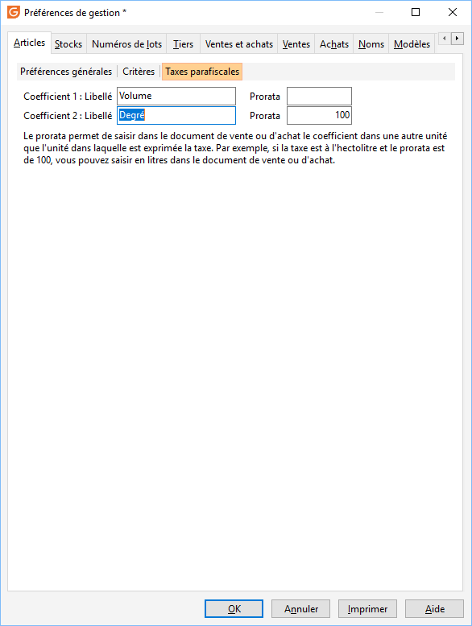
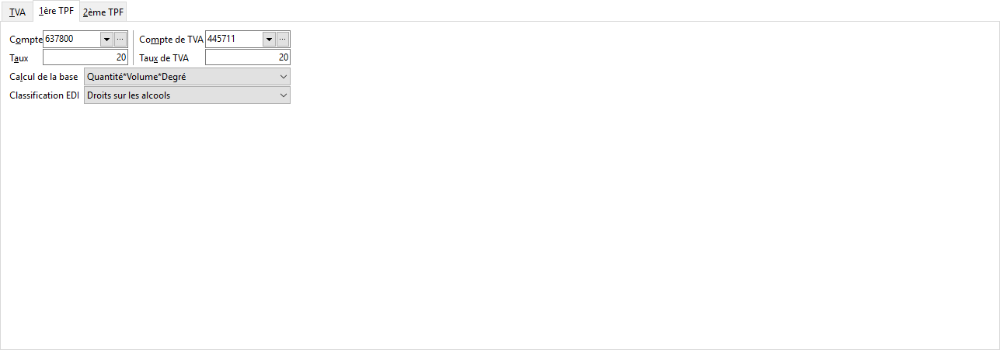
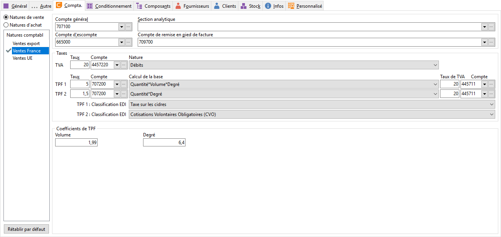
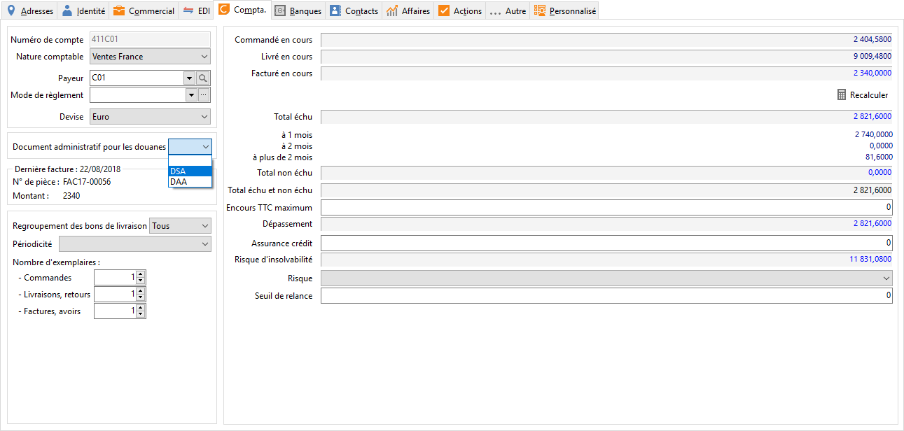
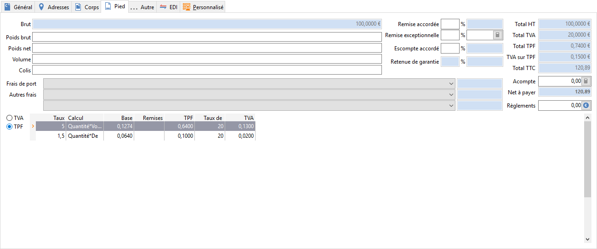
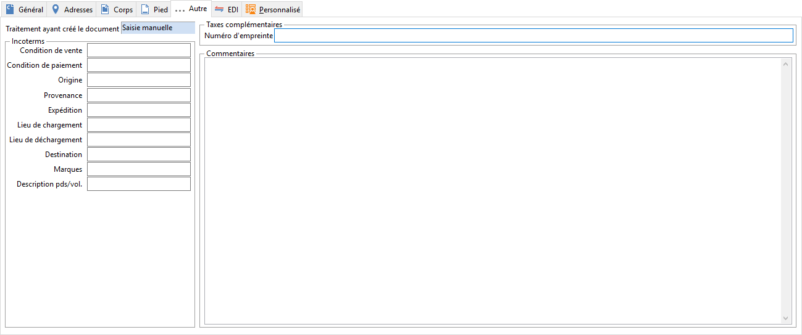

# Taxes sur les alcools dans Gestimum ERP

Gestimum vous propose une gestion complète des taxes sur l’alcool, plusieurs 
 options sont désormais disponibles :

### Préférences de gestion

Menu SOCIETE | Paramétrage | Préférences 
 de gestion, onglet "Articles | Taxes parafiscales" :

 

 

La création de ces champs permet d’identifier plus clairement les données 
 concernant les taxes et laisser en plus le libre choix à l’utilisateur 
 d’utiliser la terminologie souhaitée.

* Coefficient 
 1 et Coefficient 2 
 = Le libellé saisi correspondra à la description qui sera affichée 
 dans la Fiche article/ onglet Compta/ TPF quantité 1 et TPF quantité 
 2, ainsi que dans le libellé des formules des natures comptables onglet 
 TPF.

* Prorata 
 zone 1 et Prorata 
 zone 2 = Ces deux champs permettront de définir un prorata 
 des zones de saisies complémentaires TPF de la fiche article. Ce champ 
 vous permettra d’utiliser directement le taux dans le paramétrage 
 de la fiche article (par exemple : 3,40 euros par hectolitre pour 
 les Vins tranquilles). Le prorata sera utilisé lors du calcul de la 
 taxe dans les documents et nous obtiendrons dans le cas d’un prorata 
 de 100 et une taxe TPF2 de 3,40 la valeur de 3,40 / 100 = 0,034 €

## Natures comptables

Dans l’onglet 1ère TPF et 2ème TPF des natures 
 comptables, Vous pouvez paramétrer des TPF.

 

Ces formules se basent sur la quantité «vendue» 
 et les valeurs définies selon la formule choisie. Comme pour les TPF déjà 
 existantes, elles pourront être soumises à la TVA, et applicables les 
 unes après les autres.

 

Le champ 1 et le champ 2 correspondent aux données 
 disponibles dans la fiche article.

 

 

Dans le cadre des taxes sur l’alcool, l’utilisateur pourra nommer ces 
 champs : Degré et Volume !

## Articles

Dans l’onglet "Compta" de la fiche article, les champs TPF1 
 et TPF2 seront utilisés dans les formules de calcul des natures comptables 
 TPF.

 

## Tiers

Dans la fiche tiers (Onglet compta), une liste déroulante dans la partie 
 "Taxe complémentaires" permet la sélection d’un type de document 
 administratif (DAA/DSA) :

* DAA = Document 
 d’accompagnement administratif,
* DSA = Document 
 simplifié d’accompagnement.

 

Ce type permet d’identifier les documents du tiers devant être sélectionnés 
 pour la déclaration des taxes sur les alcools.

 

## Documents de vente et d'achat

### Onglet Pied

Une modification a été effectuée dans le récapitulatif 
 de TPF qui permet désormais de regrouper les TPF par taux et par mode 
 de calcul (hors données supplémentaires: Volume et degré).

 

Le nombre de TPF à afficher en pied de document 
 est passé à 10.

 

### Onglet Info

L’onglet info dispose désormais d’une sous partie 
 "Taxes complémentaires".

 

Le champ N° 
 d’empreinte correspond au N° de 
 timbre demandé par le service des douanes et qui numérote les documents. 
 Cette donnée est saisissable et modifiable, elle sera transférée lors 
 d’un transfert des documents. Elle n’est pas reprise lors de la duplication 
 d’un document.

 

