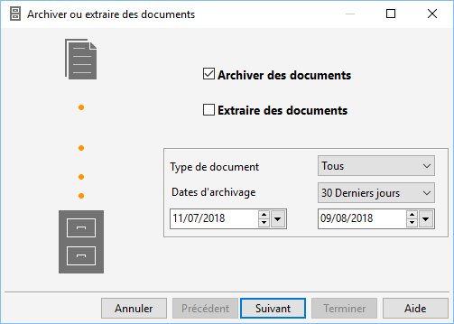
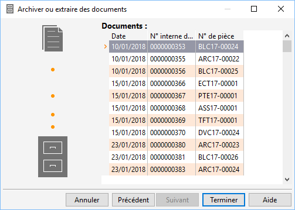

# Archivage de documents d'achat, vente ou stock

L’archivage des documents permet de déplacer les documents de ventes, 
 d’achats et/ou de stock dans une table d’archive afin d’alléger les documents 
 et accélérer, de ce fait, les traitements.

 

Peuvent être archivés :

* Les documents en 
 état "Transférés" 
 pour les documents d’achats, de ventes et de stocks,
* Les documents en 
 état "Comptabilisés" 
 pour les achats et les ventes.

 

Une fois archivés les documents ne peuvent plus être modifiés.

 

Tous les documents archivés apparaissent dans la liste des documents 
 archivés du menu Ventes/Achats ou Stocks.

 

L’extraction équivaut à une lecture du fichier d'archive afin d’obtenir 
 les documents archivés dans la liste des documents (en état Archivés) 
 et de pouvoir les dupliquer.

 

Ces documents appartiennent toutefois toujours au fichier d’archive.

## Procédure d’archivage/d’extraction

Le menu Outils propose un assistant d’archivage et d‘extraction des 
 documents qui permet désélectionner les pièces à archiver/extraire et 
 la période de réalisation.

## Choix du traitement

 

Le premier écran de l’assistant propose pour une période précise de 
 sélectionner l’archivage ou l’extraction pour :

* Tous les documents
* Les documents d’achats
* Les documents de 
 ventes
* Les documents de 
 stocks

## Liste des documents sélectionnés

 

Sur l’écran suivant, vous obtenez la liste des documents sélectionnées 
 par le traitement suite aux paramètres définis précédemment.

 

Il est également possible d’un document précis, à partir de la liste 
 des documents (menu contextuel + Archiver) et, suivant le même principe, 
 d’extraire un document archivé à partir de la liste des documents archivés 
 par ce même menu contextuel + Extraire.

 

Lorsqu’un document est extrait d’un fichier d’archive, il apparaît dans 
 la liste des documents sous l’état "Archivés".

## Recherche/liste des documents archivés

La recherche d’un document de vente, d’achat ou de stock archivés s’effectue 
 à partir de la commande "Documents archivés" du menu adéquat 
 (Ventes/Achats ou Stocks).

