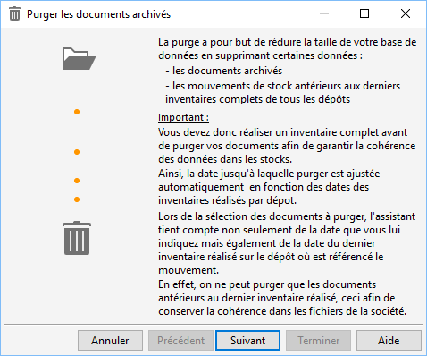
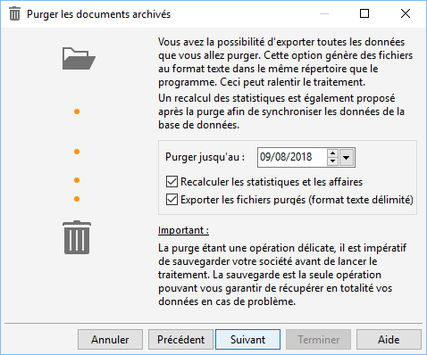
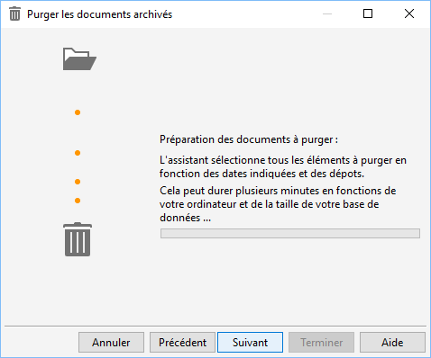
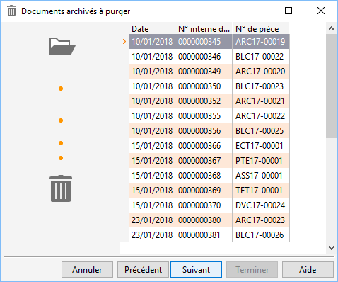

# Purge des documents d'achat, vente ou stock archivés

Ce traitement consiste à supprimer physiquement de la base les documents 
 archivés ainsi que les mouvements de stocks archivés jusqu’à une date 
 souhaitée.

## Principes et obligations

Il est indispensable de procéder à une sauvegarde du dossier avant de 
 lancer le traitement de purge, puisque celui-ci est irréversible.

 

La date jusqu’à laquelle vous souhaitez purger doit être strictement 
 supérieure au dates de dernier inventaire de tous les dépôts, auquel cas 
 la purge sera impossible car la date du dernier inventaire complet est 
 une date minimum de purge.

 

Dans le cas ou le dossier gère le stock, il est indispensable de créer 
 au minimum un inventaire complet par dépôt.

 

Lors du traitement de purge, nous vous conseillons de sélectionner les 
 deux options suivantes :

* Le recalcul des 
 statistiques : A la fin du traitement de la purge, les statistiques 
 sont recalculés automatiquement en fonction des documents restant,
* Exporter les fichiers 
 purgés : Des fichiers «texte» sont générés dans le répertoire temporaire 
 (sélectionné dans les paramètres de la société) reprenant les informations 
 des documents et mouvements purgés.

## Fonctionnement

Lors de l’appel du traitement par le menu "Outils/Purge les documents 
 archivés", deux contrôles sont réalisés :

* Le premier, vérifie 
 la présence de mouvements de stock (table ART\_MVT),
* Le deuxième est 
 lancé dans le cas où des mouvements de stock sont présents, il consiste 
 à vérifier l’existence d’inventaire complet pour chacun des dépôts. 
 S’il n’y a pas d’inventaire complet, un message vous indiquera qu’il 
 est nécessaire de réaliser un inventaire complet sur le dépôt avant 
 de purger.

 

Pour avoir des exemples de situation de purge cliquez [ici](ExemplesSituationsPurge.md).

### Étape 1 : Rappel du principe détaillé de la purge

### Étape 2 : Date

Vous devez indiquer jusqu’à quelle date vous 
 souhaitez purger, et procédez à la sélection des options détaillées ci-dessus 
 :

 

 

### Étape 3 : Recherche

Le traitement lance une recherche de la liste des documents et mouvements 
 à purger

 

### Étape 4 : Résultat

Vous visualisez le résultat de la recherche 
 dans un premier temps pour les documents et ensuite pour les mouvements. 
 Toutefois, si vous souhaitez que certains documents pour une date précise 
 ne soient pas purgés vous devrez alors modifier la date de la purge.

 

 

Une sauvegarde sera faite avant le lancement 
 de la purge. Elle sera stockée sur le serveur SQL avec le nom :

Nom de la base + "\_" + Date sous la forme 
 "AAAMMJJ\_HHMM" + "\_SauvegardeAvantPurgeDocuments.bak"

 

Par exemple :

DEMO\_20180809\_0000\_SauvegardeAvantPurgeDocuments.bak

 

Enfin, après avoir confirmé que vous souhaitiez purger votre base, le 
 traitement va [générer 
 les fichiers texte](FichiersTexteGeneresPurge.md) contenant les différents documents et mouvements 
 purgés, puis supprimer les documents et mouvements de la base.

 

Les fichiers résultants de la purge sont enregistrés dans le répertoire 
 temporaire (des préférences utilisateur). Ces fichiers sont sauvegardés 
 sous le nom suivant :

"Purge-" + Date sous la forme "AAMMJJ"+ 
 "-" + "nom de la table purgée"

 

Par exemple, pour la purge de la table Archive des Documents au 8 octobre 
 2018, vous aurez le fichier suivant :

Purge-181008-ARC\_DOCUMENTS.txt

