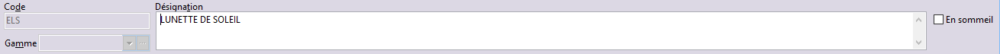

# Article

## Code article

Le code d'un article (30 caractères maximum) peut être constitué de 
 chiffres ou de lettres. Si vous travaillez en codification automatique, 
 le logiciel attribue le code de l'article lors de la validation de la 
 fiche article et utilise comme préfixe le ou les premiers caractères de 
 la désignation.

## Désignation de l'article

La désignation de l'article est constituée d'une zone de texte qui vous 
 permet de saisir jusqu'à 250 caractères (utiliser la touche Ctrl + Entrée 
 pour insérer un saut de ligne). Vous avez donc la possibilité de saisir 
 une simple description de l'article mais aussi une description détaillée.

## Gamme

Lorsque ce champ est renseigné par l’un des codes d’une gamme définie 
 dans les tables, l’article est géré avec [une 
 gamme](../../Gammes/4/Articles.md).

## Article "En sommeil"

Cet article n’apparaîtra pas dans les listes.

## Menu contextuel

En plus des fonctions classiques disponibles dans cette fenêtre les 
 fonctionnalités suivantes sont disponibles à partir de l'entête de la 
 fiche :

* Modification des 
 grilles de Tarifs
* Grilles de Tarifs 
 : Elle permet de Recopier dans un tarif sélectionné le paramétrage 
 d’un autre tarif existant, en remettant à zéro les prix et remises 
 à l’aide du bouton "Recopier les tarifs d'un article",
* Traduire l'article.

 

Chaque fiche article est composée des onglets suivants : [Général](OngletGeneral/ArticleOngletGeneral.md), [Autre](OngletAutre/ArticleOngletAutre.md), 
 [Compta](OngletCompta/ArticleOngletCompta.md), 
 [Composants](OngletComposants/ArticleOngletComposants.md), 
 [Conditionnement](OngletConditionnement/ArticleOngletConditionnement.md), 
 [Fournisseurs](OngletFournisseurs/ArticleOngletFournisseurs.md), 
 [Clients](OngletClients/ArticleOngletClients.md), 
 [Stock](OngletStock/ArticleOngletStock.md), 
 [Infos](OngletInfos/ArticleOngletInfos.md).

 

Ils doivent être définis avec le plus grand soin afin que les opérations 
 d'achats, de ventes et de suivi en stock de vos articles soient conformes 
 à ce que vous souhaitez.

 

Un onglet supplémentaire [Personnalisé](OngletPersonnalise/ArticleOngletPersonnalise.md). 
 apparaît si des champs personnalisés ont été définis.

 

Pour acheter, stocker ou vendre un article, l'identification rapide 
 de l'article est indispensable. C'est pourquoi le logiciel vous permet 
 de codifier votre article suivant un code, une désignation et éventuellement 
 un libellé court, un code à barre, et une référence constructeur.

