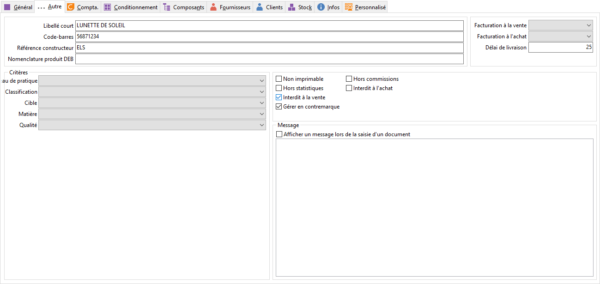

# Autre

## Informations complémentaires

### Référence constructeur

La référence constructeur (20 caractères maximum) est une information 
 très utile dans le cas d'articles qui se distinguent uniquement par le 
 constructeur (pièce de voiture, ..). Elle pourra être imprimée sur les 
 commandes fournisseurs.

 

Rappel : En saisie d’article, 
 la référence constructeur peut servir à appeler un article car c’est un 
 des champs de recherche par défaut (modifiable dans les préférences).

### Code à barres

Le code à barres permet de gérer des étiquettes articles de type (EAN, 
 Code39, .. ) Et de les lire avec une douchette ou tout autre lecteur de 
 code à barres.

 

Rappel : En saisie d’article, 
 le code à barre peut servir à appeler un article car c’est un des champs 
 de recherche par défaut (modifiable dans les préférences). Si aucune gestion 
 des codes à barres n’est réalisée sur le fichier article, il est conseillé 
 de désactiver ce champs de recherche (gain de temps de recherche).

### Libellé court

La saisie d'un libellé court offre une possibilité de plus d'appeler 
 l'article et sera utilisé comme libellé en impression de ticket de caisse.

 

Rappel : En saisie d’article, 
 le libellé court peut servir à appeler un article car c’est un des champs 
 de recherche par défaut (modifiable dans les préférences). Si le libellé 
 court n’est pas renseigné sur le fichier article, il est conseillé de 
 désactiver ce champs de recherche (gain de temps de recherche).

### Nomenclature produit DEB

Les achats et les ventes à l'intérieur de la communauté européenne, 
 doivent être déclarés dans une déclaration intra-communautaire ([DEB](../../../../Ventes/DEB/2/ParametrageArticles.md)). 
 Cette déclaration détaille les produits achetés ou vendus à l'intérieur 
 de l’union Européenne (UE) en référençant chaque article par un code unique 
 de 8 caractères.

 

Ce numéro peut être renseigné dans la famille 
 ou la sous-famille de l'article.

## Gestions particulières

### Non imprimable

Permet de ne pas imprimer l’article en édition des listes articles, 
 des documents.

### Hors statistiques

Cet article ne sera pas pris en compte dans le calcul des statistiques.

### Hors commissions

Cet article ne sera pas pris en compte dans le calcul des commissions 
 des commerciaux.

### Gérer en contremarque

Cette option à cocher ainsi que le fournisseur avec la priorité la plus 
 importante déclencheront automatiquement la génération des commandes fournisseurs 
 à la validation de l’accusé de réception fournisseur.

### Interdit à la vente ou Interdit à l'achat

Cette option permet d'interdire l'accès à l'article dans le document 
 de vente ou d'achat.

## Message

En cochant la case "Afficher un message lors de la saisie d'un 
 document" et en définissant un message dans la zone en dessous, les 
 utilisateurs qui appelleront l'article dans un document auront un message 
 d'information.

## Critères supplémentaires

Les cinq critères supplémentaires sont à définir dans les tables (Critères 
 sur articles) de la société. Ce sont des informations complémentaires 
 sur l’article mis à votre disposition pour répondre à des caractéristiques 
 articles propres à votre activité commerciale.

## Divers

### Facturation à la vente - Facturation à l'achat

Le type de facturation est à sélectionner dans la zone Facturation à 
 la vente et/ou Facturation à l'achat

 

Le [mode de 
 facturation](ModeFacturation/ModeFacturation.md) d’un 
 article peut être standard, au [Débit 
 unitaire](ModeFacturation/ModeFacturationAuDebit.md), au [Débit 
 total](ModeFacturation/ModeFacturationAuDebit.md), au [Volume 
 unitaire](ModeFacturation/ModeFacturationAuVolume.md), au [Volume 
 total](ModeFacturation/ModeFacturationAuVolume.md) ou au [Poids](ModeFacturation/ModeFacturationAuPoids.md) 
 pour les ventes et/ou pour les achats.

### Délai de livraison

Un délai de livraison général peut être défini pour tous les articles 
 dans les préférences de la gestion mais il est possible d’indiquer ici 
 un délai particulier pour cet article.

 

Ce délai sera pris en compte lors de la réalisation d’un accusé réception.

