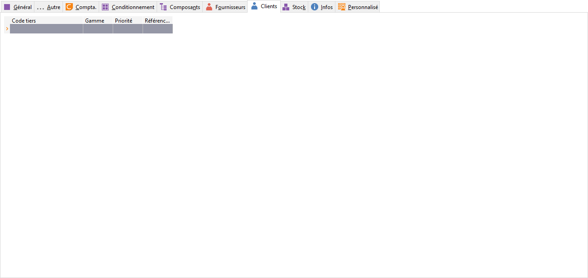

# Clients

Un onglet "Clients" est disponible pour saisir un code article spécifique par client.

 

 

Cet onglet permet de renseigner des références clients en complément du code article.

 

Champs disponibles :

* Code tiers
* Priorité
* Gamme
* Référence de l’article chez le client : ce champ sera disponible dans les lignes des documents de vente et utilisable dans les modèles d'impression. La référence affichée dans la ligne du document sera en fonction de la gamme (si elle est renseignée).

