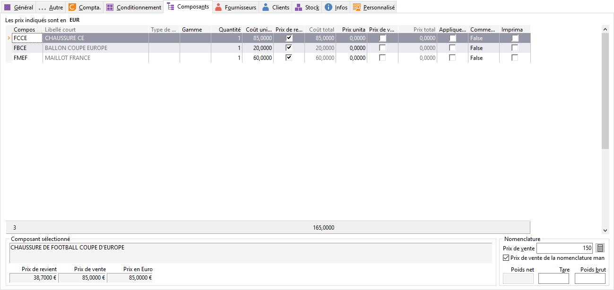

# Composants

Tous les articles composant un article de [type Forfait ou Nomenclature](../OngletGeneral/TypeArticle.md) sont à saisir ici.

 

 

Les articles gérants [les gammes](../../../Gammes/4/Articles.md), [numéros de lots](../OngletStock/GestionNumerosLots.md) et [séries](../OngletStock/GestionNumerosSeriesFicheArticle.md) peuvent être sélectionnés en tant que composants.

 

Les articles non gérés en stock peuvent être sélectionnés en tant que composant d’une nomenclature ou un forfait.

 

Vous avez la possibilité de créer (F4+Ins) ou de modifier (F4+F2) les fiches des composants directement depuis cet onglet.

## Détail des composants

### Colonnes par défaut

* Composant (PRD\_CODE)
* Libellé court (ART\_LIBC)
* Type de gamme (PRD\_TGAMME)
* Gamme (PRD\_GAMME)
* Quantité (PRD\_QTE)
* Coût unitaire (PRD\_COUT)
* Prix de revient manuel (PRD\_PR\_MAN)
* Coût Total (PRD\_COUTTOTAL)
* Prix unitaire (PRD\_PRIX)
* Prix de vente manuel (PRD\_PV\_MAN)
* Prix Total (PRD\_TOTAL)
* Appliquer grille de tarifs et promotions (PRD\_APP\_TP)
* Commentaire (PRD\_LIB)
* Imprimable (PRD\_IMP)

### Autres colonnes disponibles

* Libellé (ART\_LIB)
* Prix d'achat unitaire (ART\_P\_ACH)
* Prix de vente unitaire (ART\_P\_VTE)
* Prix de vente en Euro (ART\_P\_EURO)
* Prix de vente en unité de base (ART\_P\_VTEB)
* Prix de revient unitaire (ART\_P\_PRV)
* Par combien ? (ART\_PRIXAU)
* Type de stock (ART\_STOCK)
* Type d'article (ART\_TYPE)
* Numéro de ligne (PRD\_LIGNE)

### Entête nomenclature associer une fiche d'assemblage en saisie des documents

Cette option permet l’association s’une fiche d’assemblage aux documents de vente «à la création du document.

 

Les modifications effectuées dans la fiche s’assemblage seront prise en compte dans les documents de vente.

### Pied nomenclature prix de vente

Le prix de vente est calculé automatiquement à partir des composants mais reste modifiable.

 

Pour un article de type forfait, la modification puis la validation du prix ouvre un fenêtre permettant de répercuter le changement de prix au prorata, sur le prix de vente des différents composants ou sur les composants appartenant à une catégorie particulière.

### Recalcul automatique du prix de vente

Le recalcul du prix de vente sera géré par l’option à cocher "recalcul automatique du prix de vente".

 

Si l’option est décochée le prix de vente saisi dans cette case ne sera pas modifié par l’ajout des nouveaux composant ni des modifications effectuées dans les lignes des composants. Le prix de vente d’origine peut à tout moment être recalculé avec le bouton .

### Poids net - tare - poids brut du composé

Le poids net est automatiquement calculé à partir des composants. La tare et le poids brut sont modifiables.

### Prix de revient, prix de vente et prix en euro

Information concernant la ligne du composant sélectionné.

### Menu contextuel

* insérer une ligne de nomenclature,
* supprimer une ligne de nomenclature,
* ouvrir la fiche de ce composant
* rafraîchir la grille de saisie
* accéder à toutes les fonctions générales d'une grille. (Exporter, imprimer,..)

