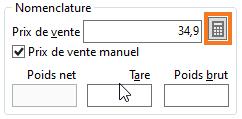
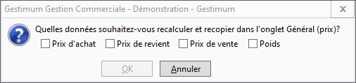

# Recalculer la nomenclature

La calculatrice située à côté du prix de vente de la nomenclature va 
 ouvrir la fenêtre suivante :

 

 

cela va permettre de recalculer et recopier les éléments proposés, dans 
 l'[onglet Général](../OngletGeneral/ArticleOngletGeneral.md) 
 de l'article :

* le prix d'achat ;
* le prix de revient ;
* le prix de vente ;
* le poids.

 

