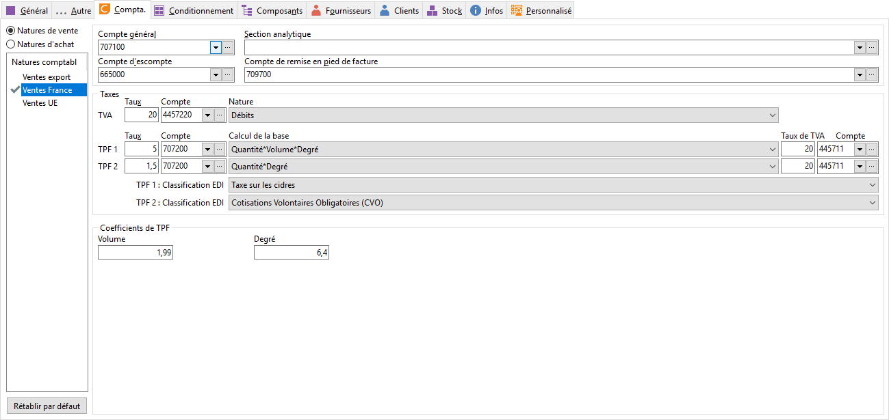

# Compta

Le logiciel propose automatiquement toutes les natures comptables en tenant compte des modifications apportées dans la fiche de la [famille article ou de la sous-famille article](../../../2/FamilleArticles.md) (si à l’appel de la famille ou de la sous-famille, l’héritage des informations a été accepté).

 

 

Ces informations sont modifiables au niveau de l’article.

## Informations

Chaque nature comptable dispose des informations suivantes :

* Compte Général,
* Escompte,
* Section analytique,
* Remise en pied de facture.

## Taxes

|   | Taux  | Compte  | Type  | Taux de TVA sur TPF  | Compte de TVA sur TPF |
| TVA |   |   |   |   |   |
| TPF (1) |   |   |   |   |   |
| TPF (2) |   |   |   |   |   |

## TPF Quantité

TPF/Quantité 1 et TPF Quantité 2 sont utilisés dans les formules de calcul des natures comptables TPF pour les taxes complémentaires (taxes sur les alcools).

