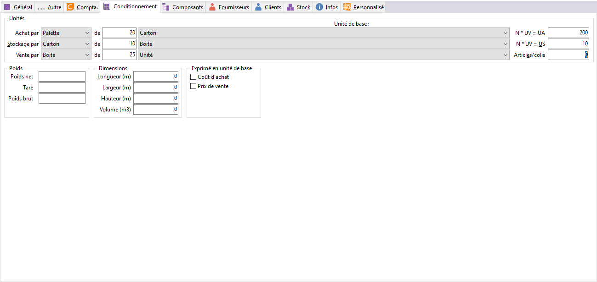

# Conditionnement

Entre le moment où l’article est reçu, déballé et vendu, celui-ci peut 
 avoir des conditionnements différents.

 

 

La fiche article permet de définir un conditionnement d’achat générique 
 (car il est possible de définir un conditionnement d’achat par fournisseur), 
 de vente et de stockage.

### Unités de conditionnement

Toutes les unités de conditionnement gérées dans la société doivent 
 être paramétrées dans les "Tables de références + Unités de conditionnement" 
 du menu SOCIETE.

 

L’unité de référence est par défaut "L'unité" mais peut être 
 modifiée dans les préférences de la société.

 

La saisie du [conditionnement 
 générique d'achat et de vente et stock](ArticleOngletConditionnement.md) est indispensable à la création 
 de la fiche article et sert ensuite pour effectuer les calculs de quantité 
 entre unités de conditionnement. Lorsque l’article n’a pas de conditionnement 
 différents, il suffit de laisser les paramètres par défaut.

### Exprimé en Unité de Base

Par défaut, le prix de vente et le prix d’achat correspondent à une 
 unité de vente et d’achat.

 

Cette option permet de définir un [prix 
 de vente article pour une unité de base de vente](../OngletAutre/ModeFacturation/ModeFacturation.md) (case PV cochée) 
 et/ou un prix d'achat pour une unité de base d'achat (case PA cochée).

## Exemple de conditionnements

Pour plus de clarté, nous allons prendre un exemple de conditionnement 
 auquel nous nous référerons par la suite.

 

L’article est acheté en palette de 20 cartons de 10 boîtes de 25 unités. 
 On le vend par boîte de 25 unités. Il est suivi dans les dépôts par carton 
 de 10 boîtes.

 

Donc :

* L’unité d’achat 
 est la palette de 20 cartons de 10 boîtes de 25 unités,
* L’unité de stockage 
 est le carton de 10 boites de 25 unités,
* L’unité de vente 
 est la boîte de 25 unités.

## Le rapport entre les conditionnements

L’unité d’achat, comme l’unité de vente ou l’unité de stockage est associée 
 à une unité de conditionnement qui peut ou non être composée de x unités 
 de base.

 

Quelque soit le type de conditionnement à paramétrer, il est important 
 que le logiciel puisse faire le lien entre l’unité de conditionnement 
 de vente et l’unité de conditionnement d’achat et entre l’unité de conditionnement 
 de vente et l’unité de conditionnement de stockage.

### Rapport entre conditionnement d’achat et conditionnement de vente

Le rapport N \* UV 
 = UA est indispensable 
 et doit être égal au nombre d’unités de vente comprises dans une unité 
 d’achat.

 

Dans l’exemple décrit plus haut, l’unité d’achat est la Palette de 20 
 Cartons de 10 Boîtes et l’unité de vente est la Boîte de 25 Unités.

 

La palette contient donc 20 \* 10 boîtes, soit 200 boîtes

 

Le rapport est donc N \* UV = UA de 200.

### Rapport entre conditionnement de stock et conditionnement de vente

Le rapport N \* UV 
 = US est également indispensable 
 et doit être égal au nombre d’unités de vente comprises dans une unité 
 de stock.

 

Dans l’exemple décrit plus haut, l’unité de stockage est le carton de 
 10 boîtes. L’unité de vente étant la boîte (cette unité est fixe, reprise 
 de l’onglet Général), le rapport doit être de 10.

## Unité de conditionnement de vente – unité de conditionnement de stockage

### Unité de conditionnement de vente

L’unité de conditionnement de vente est automatiquement proposée en 
 réalisation des documents de vente.

 

De plus, toutes les quantités en stock suivantes : stock réel, stock 
 théorique "à terme", stock mini, stock maxi, seuil d’alerte 
 sont des quantités en unités de vente

### Unité de stock

Pour la réalisation des documents de stock, il sera possible de choisir 
 l’unité de conditionnement de vente, l’unité de conditionnement de stockage 
 (à définir dans les préférences de la société) ou l’unité de conditionnement 
 d’achat.

### Unité de conditionnement d’achat

L’unité d’achat d’un article varie en fonction du fournisseur (voir 
 la fiche article + [onglet Fournisseurs](../OngletFournisseurs/ArticleOngletFournisseurs.md)).

 

L’unité d’achat saisie dans [l'onglet 
 Général](../OngletGeneral/ArticleOngletGeneral.md) sert d’unité d’achat par défaut (si aucune unité d’achat n’a 
 été associée au fournisseur) et permet au logiciel d’effectuer des conversions 
 entre les unités de conditionnements différentes.

### Unité d’inventaire

Le conditionnement de vente reprend obligatoirement le choix effectué 
 dans l’onglet Général et il est possible d’indiquer un [conditionnement](ArticleOngletConditionnement.md) 
 de stock différent du conditionnement de vente; dans ce cas il est obligatoire 
 de préciser N \* UV = US qui est le [rapport 
 entre les deux conditionnements](ArticleOngletConditionnement.md).

## Colisage

### Articles par colis

Ce nombre sert à calculer le nombre de colis livré en fonction du nombre 
 d’articles facturés (en unité de vente).

 

Exemple : si l’article est une boîte de chocolat et que vous livrez 
 des colis contenant 10 boîtes, il faut préciser 10. En facturation, la 
 vente de 105 boîtes correspondra à 11 colis dont 10 pleins.

### Poids Net / Tare / Poids Brut

La tare correspond au poids de l’emballage. Le poids net est utilisé 
 dans [la DEB.](../../../../Ventes/DEB/2/ParametrageArticles.md)

 

Le poids brut sera repris dans une [facturation 
 au poids](../OngletAutre/ModeFacturation/ModeFacturationAuPoids.md). Le type de facturation est à sélectionner dans la zone Fact/Vente 
 et/ou Fact/Achat.

## Dimensions

En [facturation 
 au Débit](../OngletAutre/ModeFacturation/ModeFacturationAuDebit.md), le logiciel utilise les informations saisies dans Longueur 
 et Largeur.

 

En [facturation 
 au Volume](../OngletAutre/ModeFacturation/ModeFacturationAuVolume.md), le logiciel utilise les informations saisies dans Longueur, 
 Largeur et Hauteur ou dans Volume.

