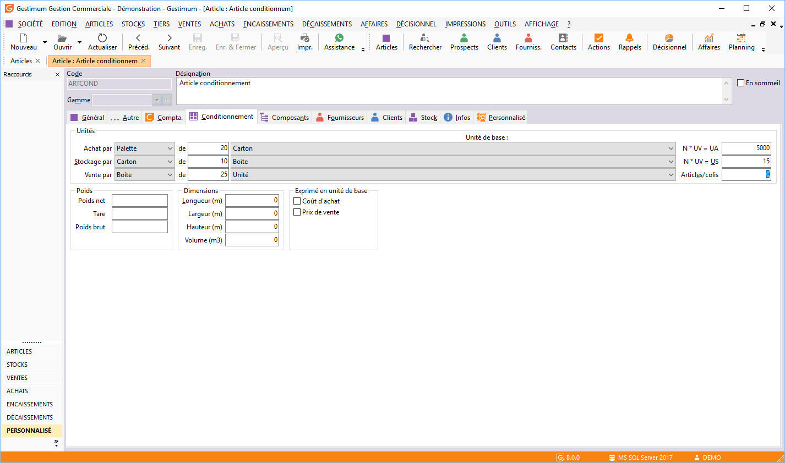
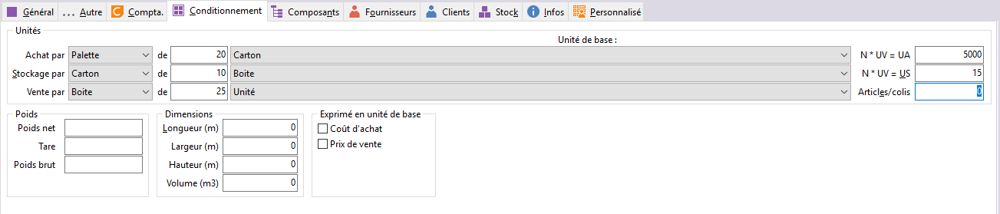

# Exemple de conditionnement

Entre le moment où l’article est reçu, déballé et vendu, celui-ci peut 
 avoir des conditionnements différents. La fiche article vous permet de 
 définir un conditionnement d’achat générique (car il est possible de définir 
 un conditionnement d’achat par fournisseur), de vente et de stockage dans 
 les onglets Général et Stock.

 

Toutes les unités de conditionnement sont à définir dans "Tables 
 + Unités de conditionnement du menu SOCIETE". L’unité de référence 
 est par défaut "Unité" mais peut être modifiée dans les préférences 
 de la gestion.

## Exemple de conditionnement

Il faut aller dans une fiche article puis dans 
 l’onglet "Conditionnement".

 

Exemple conditionnement d’un article :  Pour 
 plus de clarté, nous allons prendre un exemple de conditionnements d’article 
 auquel nous nous référerons 

par la suite. L’article est acheté en palette 
 de 20 cartons L’article est stocké en carton de 10 boites L’article est 
 vendu en boite de 25 unités.

## Le rapport entre les conditionnements

Quel que soit le type de conditionnement que vous souhaitez paramétrer, 
 il est important que le logiciel puisse faire le lien entre l’unité de 
 conditionnement de vente et l’unité de conditionnement d’achat et entre 
 l’unité de conditionnement de vente et l’unité de conditionnement de stockage.

 
  
Le rapport N 
 \* UV = UA 
 est indispensable et doit être égal au nombre (d’unités) de conditionnement 
 de ventes (UV) comprises dans 
 un conditionnement d’achat (UA). 
 Pour trouver le calcul dans l’exemple il faut faire 25 \* 10 \* 20 (c’est-à-dire 
 combien il y a d’unité dans une palette soit 5000) Le rapport N 
 \* UV = US 
 est également indispensable et est trouvé en faisant le calcul 25 \* 10 
 = 250.

 

Quand vous ferez des documents de ventes ou 
 d’achats le logiciel gérera le stock en unité.

