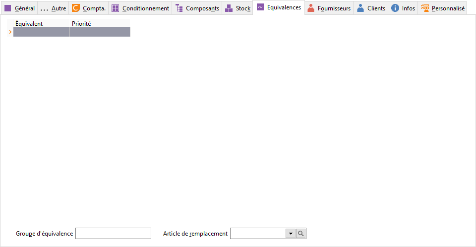

# Equivalences

## Équivalences

Pour gérer des équivalences, il est possible de saisir la référence 
 des articles équivalents et/ou de saisir un nom de groupe d’équivalence.

 

En cas d’indisponibilité de l’article, les articles équivalents définis 
 ici ou tous les articles ayant le même groupe d’équivalence, pourront 
 être consultés.

 

Vous avez la possibilité de créer (F4+Ins) 
 ou de modifier (F4+F2) les [fiches articles](../../Introduction.md) directement depuis 
 cet onglet.

 

Le menu contextuel vous permet :

* d’ajouter 
 une ligne d’article équivalent
* de supprimer 
 une ligne d’article équivalent
* de consulter 
 l'état de stock de cet article
* d’imprimer 
 suivant un modèle précis
* de rafraîchir 
 la grille de saisie
* d'accéder 
 à toutes les fonctions générales d'une grille

## Article de remplacement

L’article de remplacement sera proposé par défaut en 1er dans la liste 
 des articles équivalents.

