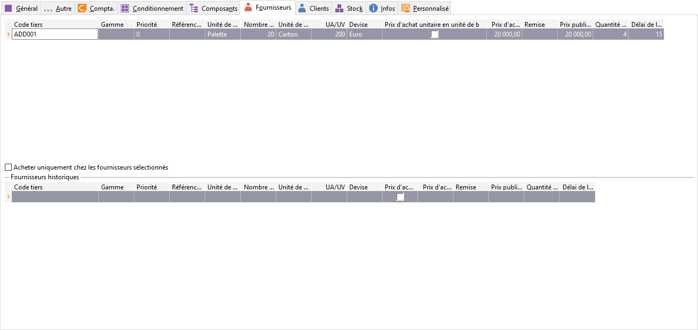

# Fournisseurs

Cet onglet permet d’enregistrer chacun des fournisseurs de l’article. 
 Si aucun fournisseur n’est associé à l’article, le logiciel appliquera 
 le [prix d'achat général](../OngletGeneral/ArticleOngletGeneral.md) 
 (onglet Général).

 

 

Pour chaque fournisseur d’un article, il est possible de préciser :

* Code 
 tiers,
* Une priorité 
 : par défaut celle de la fiche fournisseur,
* La référence 
 de l’article chez le fournisseur (30 caractères),
* L’élément de la 
 gamme de l’article (uniquement 
 pour les articles gérant les gammes),
* La quantité 
 minimum (en unité d’achat),
* Le prix 
 d’achat : prix que le fournisseur vend l’article à la société 
 (Prix remisé que nous accorde le fournisseur),
* Unité 
 d'achat,
* Prix 
 public fournisseur : prix que le fournisseur vend l’article 
 (prix catalogue)d'achat,
* Prix 
 d'achat unité de base,
* Devise,
* Conditionnement 
 d'achat,
* Unité 
 de base achat,
* UA/UV,
* Un code remise: 
 la liste des remises est à définir dans la fiche du fournisseur,
* Le délai 
 d’approvisionnement,

 

Vous avez la possibilité de créer (F4+Ins) 
 ou de modifier (F4+F2) les [fiches fournisseurs](../../../../Tiers/4/Fournisseur/Fournisseur.md) 
 directement depuis cet onglet.

 

Ces informations seront automatiquement prises en compte lors de la 
 génération manuelle ou automatique des commandes fournisseurs.

 

En facturation, le prix d’achat d’un article est réajusté en fonction 
 de [la 
 remise](../../../../Tiers/4/Fournisseur/FournisseurOngletCommercial.md) et/ou de la [grille 
 de tarifs](../../../../Tiers/4/Fournisseur/FournisseurOngletCommercial.md) associées à la fiche fournisseur.

 

NOTA : Le prix de vente ou d’achat d’un article peut être défini pour 
 un conditionnement ou l’unité de base de ce conditionnement (Exprimé en 
 UB). Le [prix 
 d'achat](../OngletGeneral/ArticleOngletGeneral.md) de l’onglet général sera automatiquement repris pour les champs 
 prix d’achat et prix de vente de l’onglet Fournisseur. A vous de les modifier 
 si vous le souhaitez.

 

Menu contextuel

* D'insérer un fournisseur,
* De supprimer un 
 fournisseur,
* D’imprimer suivant 
 un modèle précis,
* De rafraîchir la 
 grille de saisie,
* D'accéder à toutes 
 les fonctions générales d'une grille

