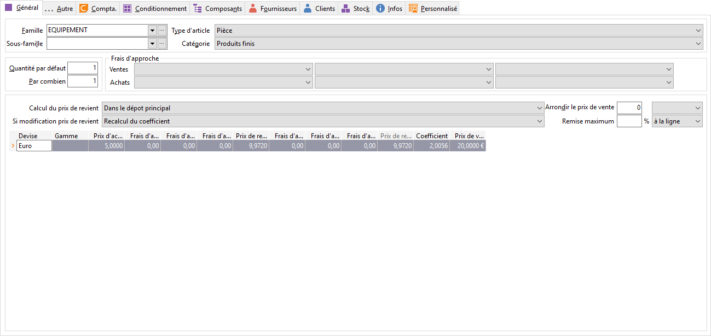

# Général

## Appartenance

### Famille et sous-famille

En création, l'appel d'une [famille 
 ou d'une sous-famille](../../../2/Introduction.md) accélère la création d'un article par l'affectation 
 des caractéristiques de la famille.

 

Ce sont les libellés des familles et sous-familles qui sont affichés.

 

En modification d’une fiche article, à l’attribution d’un code famille 
 (et sous-famille), un message propose automatiquement de remplacer les 
 caractéristiques de l'article par celles de la famille. Il est possible 
 d'accepter ou de refuser. Ce refus permet de conserver les caractéristiques 
 propres à l'article lorsqu'elles sont différentes de celles de la famille.

 

En cas de modification de la fiche de la famille ou de la sous-famille, 
 [plusieurs méthodes 
 de mise à jour seront proposées](../../../2/MethodeMiseJourArticlesFamille.md).

### Type d'article

Les articles peuvent être de plusieurs types :

* Pièce 
 : c'est un article que l'on achète
* Forfait 
 : c'est un ensemble d'articles. Le prix est défini uniquement en devise 
 société. Il n'est pas géré en stock. Lors de la vente, le contenu 
 du forfait peut être modifié. Lors du transfert en comptabilité, ce 
 sont les composants qui sont ventilés

Les composants sont à saisir dans l’onglet 
 Nomenclatures

Il est impossible de gérer [les 
 gammes](../../../Gammes/4/Articles.md) avec ce type.

* Nomenclature 
 : c'est un article composé d'autres articles qui peut ou non être 
 fabriqué. Les composants sont à saisir dans l’onglet Nomenclatures

Une nomenclature commerciale est non gérée 
 en stock, la vente a pour effet de mettre à jour les quantités des articles 
 composants

Une nomenclature de fabrication est gérée 
 en stock, une [fiche 
 d'assemblage](../../../../Stocks/Documents/Fiche/Assemblage/FicheAssemblageNomenclatures.md) doit obligatoirement être enregistrée pour mettre à jour 
 les quantités des composants. Lors de la vente, seule la quantité de la 
 nomenclature sera mise à jour.

Il est impossible de gérer [les 
 gammes](../../../Gammes/4/Articles.md) avec ce type.

* Service 
 : c'est un article non géré en stock qui permet de facturer au temps. 
 Des traitements particuliers en découlent : mise à jour de la fiche 
 Main d'œuvre des affaires, …

### Catégorie

Les catégories suivantes sont disponibles : 

* Produits Finis,
* Produits Semi-finis,
* Matières Premières,
* Main d'œuvre,
* Sous-traitance,
* Autre.

## Divers

### Quantité par défaut

C’est la quantité qui sera facturée par défaut.

### Prix au

Pour gérer des articles ayant des prix très bas, cette option permet 
 d'indiquer un prix de vente pour x unités de vente (ou de base) afin d'éviter 
 de saisir des prix avec décimales.

### Remise Maximum

En saisi d’un document de vente, si la remise de la ligne (LIG\_REMISE) 
 est plus importante que la remise définie dans la fiche article, un message 
 sera affiché : «La remise maximum autorisée pour l’article xxxx est de 
 … Fonctionnalité disponible uniquement dans les Documents de vente.

## TARIF GÉNÉRAL

### Mise à jour du prix de revient

Le champ du PUMP article sera alimenté suivant l’option choisie. Quatre 
 types sont disponibles :

* Manuelle,
* Sur le dépôt 
 principal,
* Sur tous 
 les dépôts,
* Celui du dernier mouvement d'entrée.

 

Chaque modification d’une des méthodes de mise à jour du prix de revient 
 donne un message d’avertissement et entraîne un recalcul du prix de revient.

### Entraînant la modification du

La modification du prix de revient entraînera une modification :

* Du prix de vente 
 ,
* Du coefficient.

### Frais

Les frais d’approche (à définir dans les tables de référence) s’appliquent 
 soit sur le prix de revient, soit sur le prix d’achat pour une unité d’achat, 
 soit enfin sur le prix d’achat pour une unité d’achat de base, ce qui 
 donne le prix de revient commercial.

 

Lors de la sélection d’un frais, la colonne de celui-ci s’affiche automatiquement 
 dans la grille de tarif de l’article.

 

De même, à la suppression d’un frais d’approche, la colonne ne s’affiche 
 plus automatiquement.

### Arrondi

Le mode d’arrondi du prix de vente s’appliquera sur tous les prix de 
 toutes les devises.

 

Pour arrondir le prix à la valeur entière la plus proche, il suffit 
 de saisir un 1 (le mode d’arrondi Proche est automatiquement activée).

| Prix  | Arrondi à | Proche | Inférieur | Supérieur |
|-------|-----------|--------|-----------|-----------|
| 12,82 | 1         | 13     | 12        | 13        |
| 12,82 | 0,1       | 12,8   | 12,8      | 12,9      |

 

 

Pour que le prix se termine toujours par le ou les même(s) chiffre(s), 
 saisir les chiffres à fixer et sélectionner Fixe 
 Inférieur ou Supérieur 
 ou Fixe Proche.

 

| Prix  | Arrondi à | Fixe inférieur | Fixe Supérieur | Fixe Proche |
|-------|-----------|----------------|----------------|-------------|
| 12,82 | 0,90      | 11,90          | 12,90          | 12,90       |
| 22,82 | 9,99      | 19,99          | 29,99          | 19,99       |

### Grille des Prix de l’article

Remarque

La première ligne de tarif de la fiche article est obligatoirement dans 
 la devise de la société.

#### Prix d'achat

A la création de l’article le prix d’achat saisi correspond soit à une 
 unité d’achat, soit à une unité de base d’achat (si la case PA est cochée).

#### Prix de revient

En création de la fiche article, il peut être saisi ou être calculé 
 automatiquement à partir du prix d’achat. Lorsque le prix de revient est 
 saisi, il correspond soit à une unité de vente soit à une unité de vente 
 de base (en fonction de l’option Exprimé en UB + PV).

 

S’il est calculé à partir d’un prix d’achat saisi, il est automatiquement 
 en unité de vente.

 

A chaque valorisation du stock (achat fournisseur, bon d’entrée valorisé), 
 il est réajusté en fonction [des 
 options de mise à jour sélectionnées](../OngletStock/PrixRevientValorisationStock/PrixRevientValorisationStock.md). De plus, celui-ci entraînera 
 la [modification](EntrainantModification.md) du coefficient 
 ou du prix de vente (suivant l’option paramétrée).

#### Prix de revient commercial

Il est calculé et ne peut en aucun cas être modifier.

#### Coefficient

Le coefficient lie le prix de revient commercial au prix de vente et 
 inversement.

 

A chaque revalorisation du stock, suivant l’option sélectionnée, le 
 coefficient peut-être ou non recalculé.

#### Prix de vente

A la création d’un article, le prix de vente peut être saisi ou être 
 calculé à partir de la saisie du prix d’achat ou du prix de revient.

 

Pour un article de type forfait, le prix de vente par défaut est égal 
 au total des prix des articles le composant (onglet Nomenclature), il 
 est toutefois modifiable. Dans ce cas, le logiciel propose de recalculer 
 au prorata les prix de vente des différentes lignes d’articles.

 

A chaque revalorisation du stock, suivant l’option sélectionnée, le 
 prix de vente peut-être ou non recalculé.

#### Prix de vente en devise

Il est possible de définir un prix de vente pour chacune des devises 
 gérées.

 

Pour définir un prix en devise, il faut sélectionner la devise dans 
 la liste déroulante : seules les devises pour lesquelles une date d'application 
 et un cours (ou une parité Euro) ont été définies, seront proposées.

 

Le logiciel propose alors de calculer automatiquement le prix de vente 
 en devise à partir du prix en devise société. Sinon, les zones Prix d'achat, 
 Coefficient, Prix de vente sont accessibles et permettent de saisir manuellement 
 les valeurs ; dans ce cas, le logiciel demande s’il peut lancer un recalcule 
 des autres prix en devises à partir des valeurs saisies dans la devise 
 courante.

#### Mise à jour de tarif

Suite à la [mise 
 à jour de tarif](../../MiseJourMasse/MiseJourArticlesMasse.md), seul les champs suivants sont modifiables :

* Nouveau prix d’achat (ART\_N\_ACH),
* Nouveau coefficient (ART\_N\_COEF),
* Nouveau prix de vente (ART\_N\_VTE),
* Date de mise à jour (ART\_DT\_NEW).

 

Et il est impossible de saisir dans les champs suivants :

* Prix d’achat (ART\_P\_ACH),
* Coefficient (ART\_P\_COEF),
* Prix de vente (ART\_P\_VTEB).

