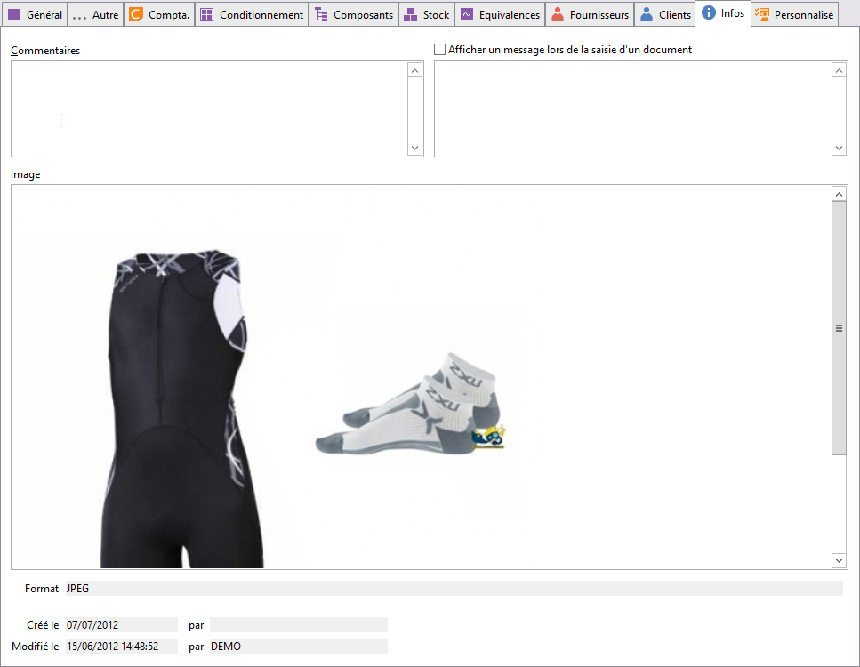

# Infos

## Commentaires

Une zone d’environ 36 lignes est disponible pour saisir des informations 
 complémentaires sur l’article. Pour récupérer ce commentaire dans un document, 
 il est nécessaire d’activer l’option Insérer commentaire dans les préférences 
 puis d’ajouter la colonne (LIG\_MEMO) dans le corps d’un document de vente 
 ou d’achat par les propriétés du document.

 

## Afficher un message lors de la saisie d'un document

En activant cette option, il vous est possible de faire apparaître un 
 message, lors de la saisie de l'article dans un document d'achat / vente 
 / stock.

## Image

Un clic droit sur cette zone permet d’insérer (Sélectionner une image), 
 Enregistrer l’image sous un autre nom, supprimer l’image au format : JPG, 
 JPEG, GIF, EMF, WMF, BMP,ICO.

 

De plus, vous avez la possibilité de voir les propriétés de celle-ci 
 (Couleur, hauteur, largueur, taille, type).

## Divers

Date & utilisateur de création, date & utilisateur de modification.

