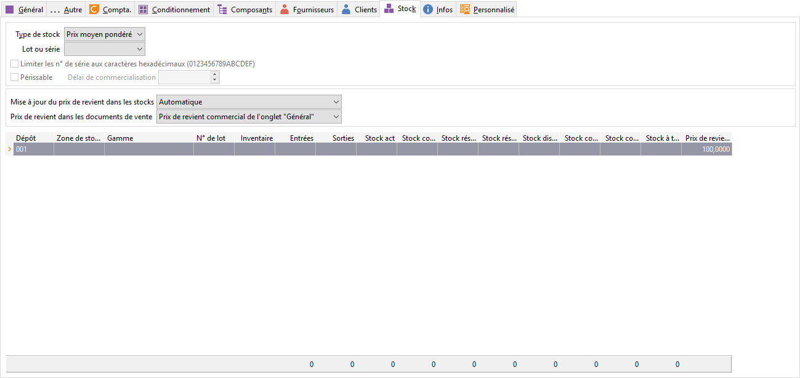

# Stock

## Type de stock

Les différents types de stock proposés par le logiciel sont les suivants :

* Non géré,
* Non valorisé,
* Prix Moyen Pondéré,
* Dernier Prix d’achat,
* Prix Moyen d’Achat,
* FIFO,
* LIFO.

 

A chaque mouvement valorisé, la valeur du stock est recalculé selon ce type.

 

Pour un article non géré en stock, la mise à jour du prix de revient sera automatiquement "Manuelle" et la sélection du prix de revient sera automatiquement "De l’article".

### LIFO (Last In, First Out)

LIFO équivalent à DEPS (Dernier Entré, Premier Sorti).

 

Pour un article géré en LIFO, la valeur de sortie est égale au coût du dernier article entré.

### FIFO (First In, First Out)

FIFO équivalent à PEPS (Premier entré, Premier Sorti).

 

Pour un article géré en FIFO, la valeur de sortie est égale au coût de l’article dont la date d’entrée est la plus ancienne.

### DPA (stock en Dernier Prix d'Achat)

En DPA, la valeur en stock d’un article est égale au dernier prix d’achat entré.

## Mode de gestion

* Lot : c'est un article qui permet de gérer plusieurs numéros de lots
* Sérialisé : c'est un article dont chaque entrée ou chaque sortie est repéré par un ensemble de numéros de série

## Article périssable

Cette option peut être sélectionnée uniquement pour les articles ayant le mode de gestion "lot".

 

Si des lignes de stock existent pour cet article, vous pourrez transformer l’article en périssable, uniquement si la [date de péremption](../../../../Stocks/NumerosLots/Trier/DatePeremption.md) est renseignée sur toutes les lignes.

## Délai de commercialisation

Il peut-être indiqué seulement si l’article est défini comme [périssable](../../../../Stocks/NumerosLots/Trier/ArticlePerissable.md). Il peut-être affecté par défaut en fonction du paramétrage des préférences de la gestion, de la [famille](../../../2/FamilleArticlesOngletStock.md) ou [sous-famille d'article.](../../../3/SousFamilleArticlesOngletStock.md)

 

Suivant ce délai, un champ date dans l'onglet stock de la fiche article est calculé, c’est la date limite de commercialisation du lot.

## Prix de revient

### Mise à jour dans les stocks

La mise à jour dans les stocks du prix de revient (STK\_P\_PRV) peut être :

* [Automatique](PrixRevientAutomatique.md),
* [Manuelle](PrixRevientManuel.md).

### Sélection du prix de revient

La sélection du prix de revient qui figurera dans les documents ou/et les statistiques se réalise en fonction :

* De l'onglet général de l'article,
* De l'onglet stock de l'article.

 

Cas particulier, pour un inventaire, le prix de revient sera OBLIGATOIREMENT celui du stock. Celui-ci est affecté par défaut lors de la génération automatique des lignes.

## Total des mouvements par dépôt

Pour chaque dépôt, le logiciel affiche le total des différentes quantités suivies sur l’article. Un double-clic sur la ligne du dépôt permet d’accéder au détail des mouvements pour cet article dans le dépôt.

 

Pour les articles gérant les numéros de lot, vous avez la possibilité de créer un numéro par la saisie de celui-ci dans la colonne ‘’N° de lot’’. De même, vous pouvez renseigner la date de péremption (si l’article est périssable).

 

La date limite de commercialisation est visible si le numéro de lot est renseigné et que l’article est périssable. Elle sera calculée si le délai de commercialisation est renseigné. Elle n’est pas saisissable.

 

De plus, il est possible de visualiser [les lots périmés ou non](../../../../Stocks/NumerosLots/Trier/ArticlePerime.md) par une coche dans le champ "Périmé ?" STK\_PERIME (disponibles dans les propriétés de la grille).

 

Vous avez la possibilité de créer (F4+Ins) ou de modifier (F4+F2) les fiches dépôts directement depuis cet onglet.

## Menu contextuel

* D'insérer une ligne de stock,
* De supprimer une ligne de stock,
* De consulter les mouvements de stock,
* D’imprimer suivant un modèle précis,
* De rafraîchir la grille de saisie,
* D'accéder à toutes les fonctions générales d'une grille

