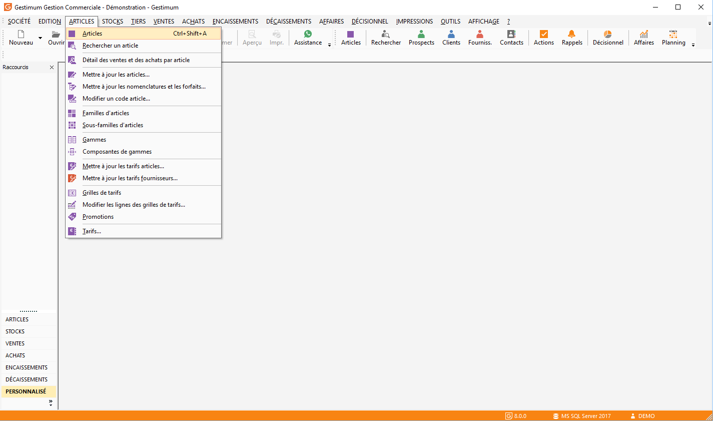
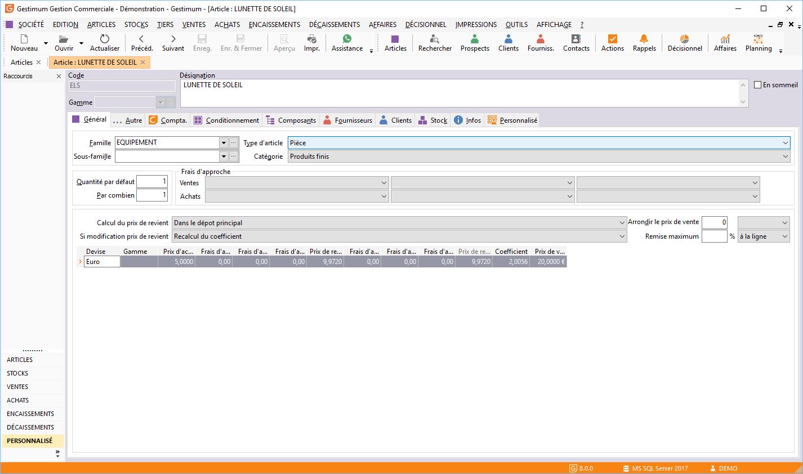
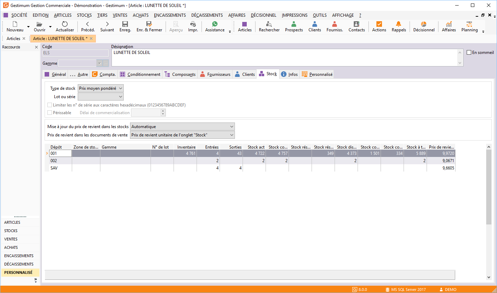
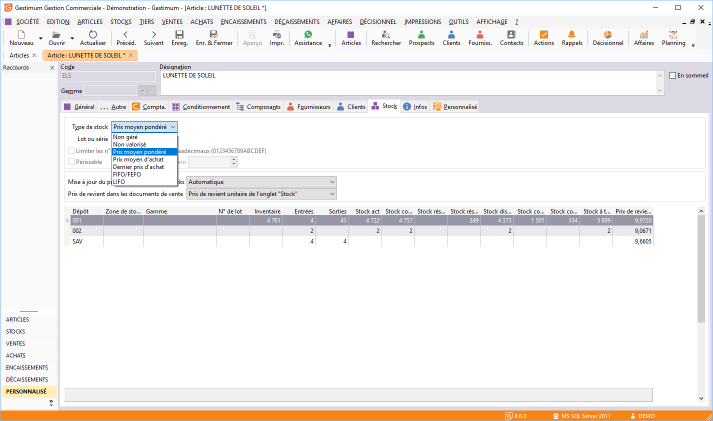

# Prix de revient et valorisation du stock

Le prix de revient permet de valoriser du stock mais également de calculer 
 les marges commerciales au document de vente.

## Distinction du prix de revient et son rôle

Il faut aller dans une fiche article "ARTICLES/Articles".

 

Gestimum propose donc aux utilisateurs de gérer 
 2 valeurs de prix de revient :

* Le premier affiché 
 (ART\_P\_PRV) dans l’onglet 
 "Général" de la fiche article (sert au calcul du prix de 
 vente et/ou à la remontée dans les documents de vente pour le calcul 
 de la marge),
* Le second (STK\_P\_PRV) consultable dans l’onglet 
 "Stock" de la fiche article ou depuis la consultation des 
 stocks (sert à la valorisation de stock et/ou à la remontée dans les 
 documents de vente pour le calcul de la marge).

### Prix de revient de l'onglet "Général"

Vous avez la possibilité de choisir le calcul du "prix de revient" 
 : 

* Manuel 
 : Aucune mise à jour par rapport aux entrées de stock (BRF / SE / 
 autre), mais uniquement par la saisie dans l’onglet général sur le 
 champ "Prix de Revient",
* Dans le dépôt principal : (Défini dans les préférences 
 de Gestion / Onglet Stock): La valeur du champ prix de revient se 
 mettra à jour, seulement lors de mouvements sur le dépôt principal. 
 La valeur sera celle correspondant à la méthode de valorisation définie 
 dans l’onglet stock sur "type de stock" calculée qu’avec 
 les éléments du dépôt principal,
* Dans tous 
 les dépôts : La valeur du champ prix de revient de l’onglet 
 général, sera mis à jour lors de mouvements quel que soit le dépôt. 
 La valeur sera celle correspondant à la méthode de valorisation définie 
 dans l’onglet stock sur "type de stock", mais calculée avec 
 l’ensemble des éléments des dépôts (sorte de moyenne de Prix de revient 
 tous dépôts confondus),
* Celui du dernier mouvement d’entrée : La 
 valeur du champ prix de revient de l’onglet général, sera mis à jour 
 lors de mouvements quel que soit le dépôt. La valeur sera celle du 
 prix d’achat du dernier mouvement.

 

La modification du prix de revient entraînera :

* Le recalcul du 
 coefficient
* Le recalcul du 
 prix de vente

### Prix de revient de l'onglet "Stock"

Vous pouvez mettre à jour le "prix de revient" dans le stock 
 :

* Automatiquement,
* Manuellement.

 

Et sélectionner le prix de revient dans les documents de vente :

* Soit du prix de 
 revient commercial de l’onglet "Général",
* Soit du prix unitaire 
 de l’onglet "Stock".

 

L’option de l’onglet stock "Sélection du prix de revient" 
 permet de choisir le prix de revient utilisé pour le calcul de marge dans 
 les documents de vente.

 

S’il n’y a pas de frais d’approche, les prix de revient de l’onglet 
 général et de l’onglet stock sont identiques.

## Règles de mise à jour et de calcul

Pour gérer ces deux valeurs de Prix de revient, vous allez pouvoir dissocier 
 le rythme de mise à jour de ces valeurs.

 

Pour le prix de revient de l’onglet "Stock" 
 (Prix Unitaire), il se calcule en permanence (indépendamment des règles 
 de l’onglet général), dépôt par dépôt en fonction de la méthode choisie 
 dans la zone "Type de Stock" 
 et des mouvements de réception et d’entrée de stock.

 

Rappel des règles de calcul :

* Non 
 géré : L’article ne sera pas géré en stock,
* Non 
 valorisé : L’article sera géré en stock mais n’aura aucune 
 valeur,
* Prix 
 moyen pondéré : (PUMP – stock en prix unitaire moyen pondéré) 
 : En PMP, la valeur en stock d’un article 
 est égale au prix moyen des achats et des bons de retour. Soit : (Qté1 
 x Px achat) – (Qté2 x Px retour) + (Qté3 x Px achat) - (Qté4 x Px 
 retour) / (Qté1 – Qté2 + Qté3 – Qté4),
* Prix 
 moyen d’achat (PMA – stock en prix moyen d’achat) : En 
 PMA, la valeur en stock d’un article est égale au prix moyen pondéré 
 des différents prix d’achats. Soit : (Qté1 x prix d’achat1) + (Qté2 
 x prix d’achat2) + (Qté3 x prix d’achat3) / (Qté1 + Qté 2 +Qté 3),

* Dernier 
 prix d’achat : Pour les articles gérés en dernier prix d’achat, 
 la valeur en stock d’un article est égale au dernier prix d’achat 
 entré,
* LIFO 
 (Last In, First Out) (Dernier Entré, Premier Sorti) : Pour un article 
 géré en LIFO, Les sorties sont valorisées au prix de l’article le 
 plus récent des stocks, c’est-à-dire sur la base des derniers coûts 
 d’achat ou de production. Attention ne fonctionnera qu’avec des articles 
 ayant une gestion avec numéro de lot,
* FIFO 
 (First In, First Out) (Premier Entré, Premier Sorti) : Pour un article 
 géré en FIFO, les sorties sont valorisées au coût de l’article le 
 plus ancien dans les stocks. Ainsi les stocks sont évalués aux derniers 
 coûts d’acquisition ou de production.

## Cas des nomenclatures

Pour le produit fini géré en stock (nécessite 
 une fiche d’assemblage) :

Le rôle des prix de revient est similaire c'est-à-dire 
 que le prix de revient de l’onglet général réagira en fonction du réglage 
 de la zone "Mise à jour du prix de revient" et des dépôts sur 
 lequel est effectué l’assemblage.

 

La valeur sera calculée avec la valeur du prix 
 de revient des composants propre à leur dépôt de déstockage (valeur mise 
 à jour au fur et à mesure des réceptions des composants).

 

En cas d’achat de cette nomenclature, le fonctionnement 
 est similaire à un article.

 

Exception : 
 L’utilisation de la calculette en bas de l’onglet "Nomenclature", 
 permet de réactualiser le prix de revient de tous les composants dans 
 l’onglet nomenclature du produit fini, et de ramener le résultat de cette 
 actualisation dans l'onglet général.

 

Dans tous les cas, le prix de revient des composants 
 utilisés dans une fiche d’assemblage ou l’onglet nomenclature, est celui 
 de l’onglet stock.

