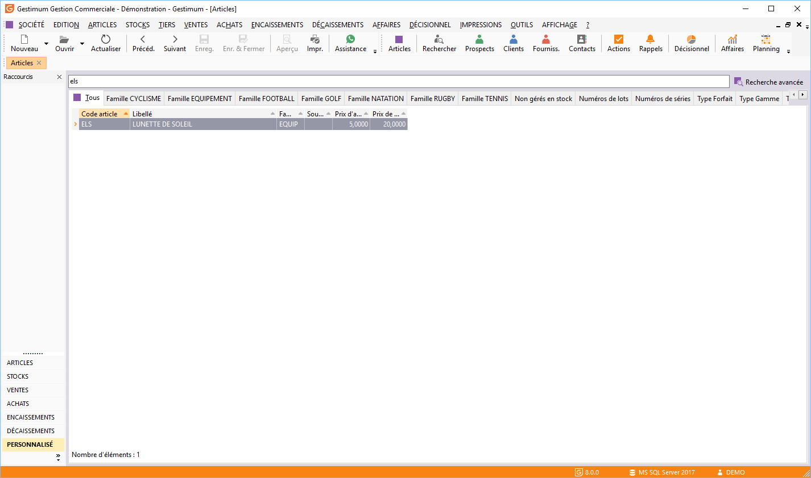
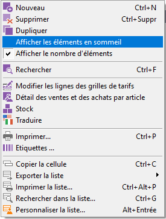

# Liste des articles

La liste des articles est accessible (sauf en mode Fiche) à partir de 
 la commande Articles du menu ARTICLES ou par l’icône "Articles" 
 et donne accès à la gestion des [fiches articles](Article/Article.md) 
 qui s’effectue à partir de la barre d'outils, du menu contextuel ou des 
 raccourcis claviers.

 

En mode Fiche, la liste est accessible à partir de la fiche article 
 par simple clic sur l’icône Ouvrir de la barre d’outils.

 

 

Toutes les listes ont un fonctionnement commun.

## Recherche d’articles

Deux possibilités de recherche d’articles sont disponibles: la recherche 
 standard, commune à toutes les grilles et la [recherche 
 plus poussée](Recherche/RechercheArticles.md) accessible par le menu Édition ou par clic dans la zone 
 Rechercher puis la combinaison de touches Ctrl 
 + F.

## Duplication de la fiche article

Lors de la duplication , le libellé de l’article d’origine est conservé 
 ainsi que toutes les infos concernant l’article d’origine.

## Opérations disponibles à partir de la liste des articles

 

Pour chaque article de la liste, le menu contextuel (clic droit) permet 
 d’accéder :

* A l’affichage ou 
 non des articles en sommeil,
* A la recherche 
 avancée,
* A la modification 
 des lignes de grille tarifs,
* Au détail des ventes 
 et des achats par article qui affiche la liste des pièces de ventes 
 et d’achats dans lesquels cet article intervient. Ce détail peut être 
 demandé pour un tiers particulier, une période à déterminer et pour 
 un type de document,
* A un état de stock 
 de l'article qui permet d’obtenir le stock actuel et le stock à terme 
 d’un article et de ses équivalents,
* A la traduction 
 des articles,
* Aux fonctions générales 
 d'une grille.

