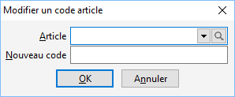

# Modifier un code article

Cet outils permet de renommer un code article dans un autre code. Le 
 nouveau code sera automatiquement affecté à la place du précédent dans 
 tous les documents, mouvements, grilles de tarifs, promotions, nomenclature 
 …

 

## Modalités pour pouvoir effectuer la réimputation

### Droit

Vous devez avoir sélectionner par le menu SOCIETE 
 | Utilisateurs le droit d’exécuter sur l’option "Outils" 
 + "Réimputations" et le droit "Article" pour pouvoir 
 exécuter ce traitement.

## Paramétrage et lancement de la réimputation

Sélectionnez ou saisissez le code article que vous souhaitez renommé 
 (Article d’origine). Puis, saisissez le nouveau de code de l’article (article 
 destinataire).

 

Ensuite, vous devez lancer la réimputation par le bouton Renommer. 
 Un message vous demandera de confirmer le changement de code et dans l’affirmatif 
 le code article sera renommé.

