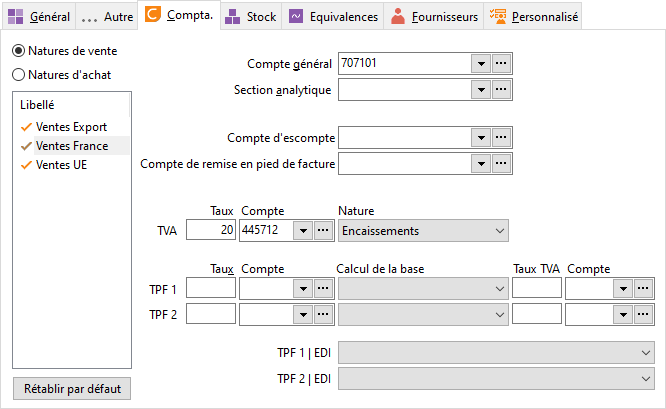

# Compta

Le logiciel propose par défaut les informations paramétrées dans la 
 fiche de chaque nature comptable. Ces informations étant modifiables, 
 il est possible de paramétrer un traitement comptable particulier pour 
 chaque famille et chaque type de vente et d’achats.

 

 

Exemple : Le compte comptable proposé pour suivre les articles de cette 
 famille est le compte général indiqué dans la fiche de la nature comptable 
 (par exemple 707100 pour les ventes). Pour distinguer les ventes des articles 
 d’une famille, il suffit d’indiquer un autre compte général (par exemple 
 7071010).

