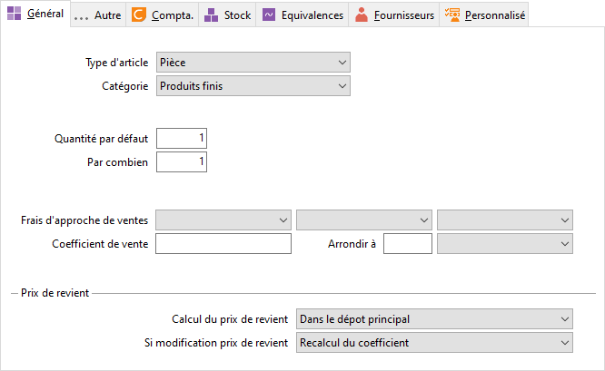

# Général

A la sélection d’une famille, sous-famille d’article sur une fiche article, 
 tous les champs de cet onglet seront repris dans la fiche article si vous 
 acceptez les valeurs de la famille.

 

## Appartenance

### Type d’article

Voir [fiche 
 Articles](../1/Article/OngletGeneral/ArticleOngletGeneral.md).

### Catégorie

Voir [fiche 
 Articles](../1/Article/OngletGeneral/ArticleOngletGeneral.md).

## Tarification de l’article

### Tarification

Voir [fiche 
 Article](../1/Article/OngletGeneral/ArticleOngletGeneral.md).

### Mode de facturation

Permet de sélectionner ici le mode de facturation pour les ventes. Voir 
 [fiche Articles](../1/Article/OngletAutre/ArticleOngletAutre.md).

### Quantité par défaut

Voir [fiche 
 Articles](../1/Article/OngletGeneral/ArticleOngletGeneral.md).

### Prix au

Voir [fiche 
 Articles](../1/Article/OngletGeneral/ArticleOngletGeneral.md).

## Définition du prix de revient

### Mise à jour du prix de revient

Voir [fiche 
 Article](../1/Article/OngletGeneral/ArticleOngletGeneral.md).

### Entraînant la modification du

Voir [fiche 
 Article](../1/Article/OngletGeneral/ArticleOngletGeneral.md).

## Divers

### Nomenclature produit DEB

Voir [fiche 
 Articles](../1/Article/OngletAutre/ArticleOngletAutre.md).

### Groupe d’équivalence

Voir [fiche Articles](../1/Article/OngletInfos/ArticleOngletInfos.md).

### Non imprimable

Voir [fiche 
 Articles](../1/Article/OngletAutre/ArticleOngletAutre.md).

### Hors Statistiques

Voir [fiche 
 Articles](../1/Article/OngletAutre/ArticleOngletAutre.md).

### Hors commission

Voir [fiche 
 Articles](../1/Article/OngletAutre/ArticleOngletAutre.md).

### Gérer en contremarque

Voir [fiche 
 Articles](../1/Article/OngletAutre/ArticleOngletAutre.md).

