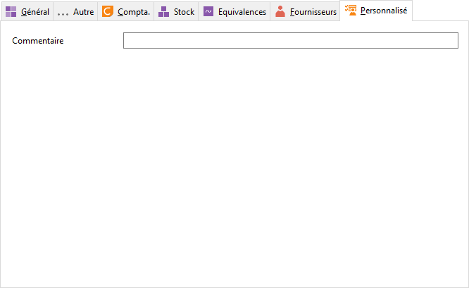

# Personnalisé

Cet onglet s’affiche uniquement si des champs Personnalisés ont été 
 créés dans la table Familles d’articles (ART\_FAM) pour une fiche Famille 
 ou dans la table Sous-famille d’articles (ART\_SFAM) pour une fiche Sous-famille.

 

 

Lorsque le champ Utilisateurs est également créé dans la table Article 
 (même code, même type), ce champ est pris en compte lors de la mise à 
 jour des articles après [modification 
 de la fiche famille d'articles ou sous-famille d'articles](MethodeMiseJourArticlesFamille.md).

