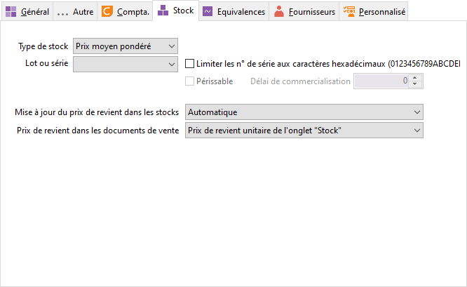

# Stock

A la sélection d’une famille ou sous-famille d’article sur une fiche 
 article, tous les champs de cet onglet seront repris dans la fiche article 
 si vous acceptez les valeurs de la famille.

 

## Gestion du stock

### Type de stock

Voir [fiche article](../1/Article/OngletStock/ArticleOngletStock.md).

### Mode de gestion

Voir [fiche article](../1/Article/OngletStock/ArticleOngletStock.md).

### Article périssable

Voir
[fiche article](../1/Article/OngletStock/ArticleOngletStock.md).

### Délai de commercialisation

Voir
[fiche article](../1/Article/OngletStock/ArticleOngletStock.md).

## Prix de revient

### Mise à jour dans les stocks

Voir [fiche article](../1/Article/OngletStock/ArticleOngletStock.md).

### Sélection du prix de revient

Voir [fiche article](../1/Article/OngletStock/ArticleOngletStock.md).

