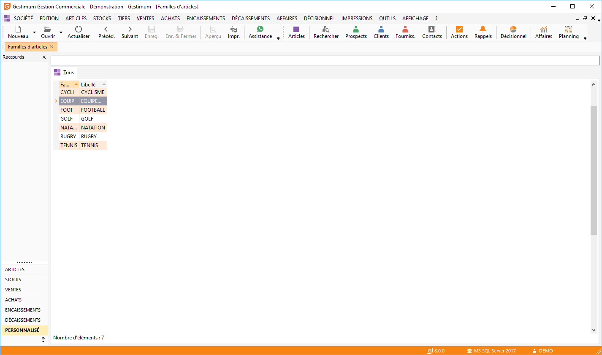

# Liste des familles d'articles

La liste des familles est accessible à partir de la commande Familles 
 d’articles du menu ARTICLES et permet de gérer (création, modification, 
 suppression, impression) les [fiches familles](FamilleArticles.md) 
 à partir de la barre d'outils, du menu contextuel ou des raccourcis claviers.

 

Toutes les listes ont un fonctionnement commun.

 

Par le menu contextuel, vous avez la possibilité 
 d'accéder à [la 
 modification des grilles de tarifs](../GrillesTarifsPromotions/1/OutilModificationGrillesTarifsMasse.md) qui affiche 
 les grilles de tarifs pour lesquelles l’article sélectionné est affecté.

